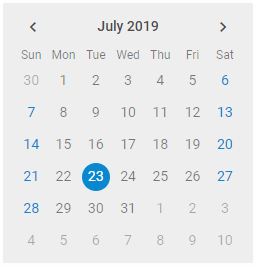

There is a possibility to make changes in the look and feel of a calendar. For example, change its background color:

{{editor    https://snippet.dhtmlx.com/2045cbe1	Calendar. Adding Custom Styles}}

For this you need to take the following steps:

- add a new CSS class(es) with desired settings in the &lt;style&gt; section of your HTML page or in your file with styles (don't forget to include your file on the page in this case)

~~~js

~~~

- specify the name of the created CSS class (or names of classes separated by spaces) as the value of the calendar/api/calendar_css_config.md property in the Calendar configuration:

~~~js
var calendar = new dhx.Calendar({
    css:"my_first_class my_second_class"
});
~~~

For example:

~~~js

var calendar = new dhx.Calendar("calendar", { 
	css: "bg-grey dhx_calendar--bordered" 
});
~~~
