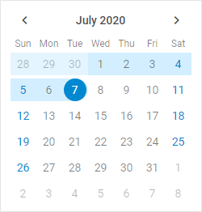

https://snippet.dhtmlx.com/2mrj53h0	Calendar. Range

You have a possibility to create a calendar in the range mode that allows you to select a range of dates in the calendar. To do this, you need to use the [range:true](/calendar/api/calendar_range_config) option in the calendar configuration object and define an array with the start and end dates of the range.

~~~js
var calendar = new dhx.Calendar("calendar", {
	css: "dhx_widget--bordered",
	range: true,
    value: ["25/06/20", "07/07/20"]
});
~~~

:::note
The <strong>value</strong> option should have the array type and contain a pair of values (either Date values or string values) for both dates.
1
:::

