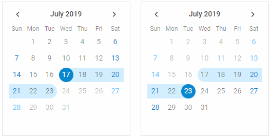

You can create two calendars and link them to provide the ability of selecting a date range. The first calendar will be used for setting the start date of the range, while the end date of the range will be specified in the
second calendar. 

Use the calendar/api/calendar_link_method.md method and pass as a parameter the object of the second calendar to link the first calendar to.
In the example below the [Change](calendar/api/calendar_change_event.md) event is intended to output the start and end dates of the selected range:

~~~js
var calendar = new dhx.Calendar("calendar1", { css: "dhx_calendar--bordered" });
var calendar2 = new dhx.Calendar("calendar2", { css: "dhx_calendar--bordered" });

calendar.link(calendar2);

calendar.events.on("change", function (date) {
	document.querySelector("#resultFrom").innerHTML = 
    	"Date from: " + calendar.getValue() + " ";
});

calendar2.events.on("change", function (date) {
	document.querySelector("#resultTo").innerHTML = 
    	"Date to: " + calendar2.getValue() + " ";
});
~~~

{{editor    https://snippet.dhtmlx.com/dxo54017	Calendar. Date Range}}