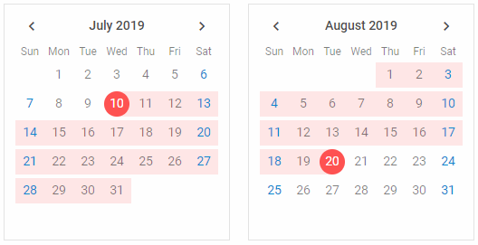

{{editor    https://snippet.dhtmlx.com/9u0ix3na	Calendar. Custom Styles For Selected Date}}

You can apply custom styling to dates selected in a calender as well as to [date ranges](calendar/operating_calendar.md#linkingtwocalendars). There are system styles you need to change for this purpose:

~~~js

var calendar1 = new dhx.Calendar("calendar1", {css: "dhx_widget--bordered"});
var calendar2 = new dhx.Calendar("calendar2", {css: "dhx_widget--bordered"});
~~~

