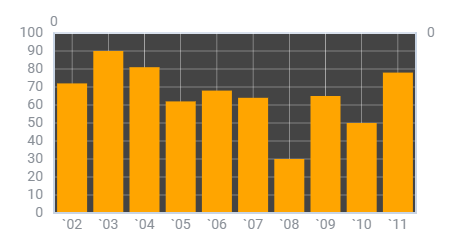
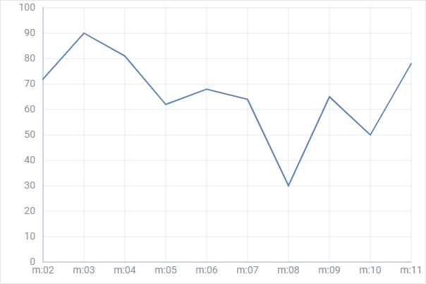
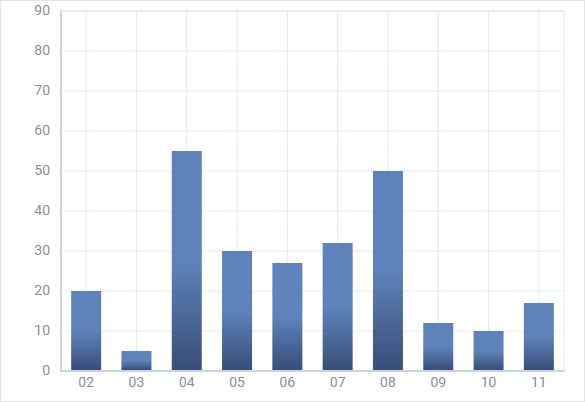
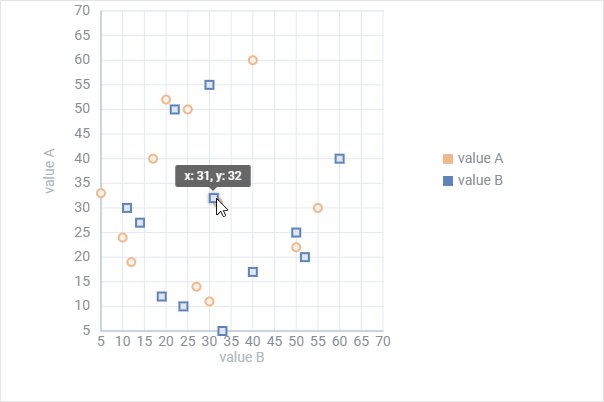
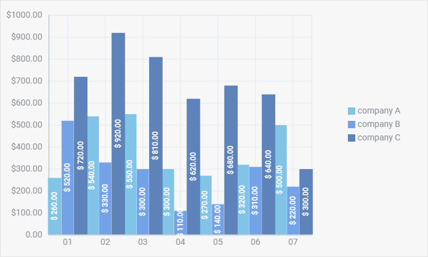

---
sidebar_label: Customization
title: Customization
---          

Styling chart
----------------

There is a possibility to make changes in the look and feel of a chart.

{{editor	https://snippet.dhtmlx.com/p82iew5s	Chart. Custom Styling}}

For this you need to take the following steps:

- add a new CSS class(es) with desired settings in the &lt;style&gt; section of your HTML page or in your file with styles (don't forget to include your file on the page in this case)

~~~js

~~~

- specify the name of the created CSS class (or names of classes separated by spaces) as the value of the [css](chart/api/chart_css_config.md) property in the Chart configuration:

~~~js
var chart = new dhx.Chart({
    css:"my_first_class my_second_class"
});
~~~

For example:

~~~js

const chart = new dhx.Chart("chart", {
    type: "bar",
    css: "custom-class dhx_widget--bg_white dhx_widget--bordered",
    scales: {
        "top": {
            size: 100
        },
        "bottom" : {
            text: "month", size: 100
        },
        "left" : {
            size: 100, maxTicks: 10, max: 100, min: 0
        },
        "right": {
            size: 100
        }
    },
    series: [
        {
            id: "A", value: "company C", color: "#5E83BA",
            pointType: "circle", fill: "#5E83BA", size: 35
        }
    ]
});
~~~

Adding template to scale labels
-------------------------------

{{editor	https://snippet.dhtmlx.com/nhm3438n	Chart. Text Template For Scale Labels}}

While configuring chart scales you can add a template for the labels of the scales by using the **textTemplate** configuration option of [scales](chart/configuration_properties.md#scales):

~~~js
const chart = new dhx.Chart("chart", {
    type:"line",
    css: "dhx_widget--bg_white dhx_widget--bordered",
    scales: {
        "bottom" : {
            text: "month",
            textTemplate: function(month) { /*!*/
                return "m:" + month; /*!*/
            } /*!*/
        },
        "left" : {
            maxTicks: 10, max: 100, min: 0
        }
    },
    series: [
        {
            id: "A", value: "company C", color: "#5E83BA", strokeWidth: 2
        }
    ]
});
~~~

Adding color gradient for bars
--------------------------------

{{editor	https://snippet.dhtmlx.com/j3duyn2q	Chart. Bar Gradient}}

It is possible to define a color gradient for bars with the help of the **gradient** option of [series](chart/configuration_properties.md#series). You need to set its value as a function that takes the color of the series filling in Hex format as a parameter:

~~~js
const chart = new dhx.Chart("chart", {
    type:"bar",
    css: "dhx_widget--bg_white dhx_widget--bordered",
    scales: {
        "bottom" : {
            text: "month",
        },
        "left" : {
            max: 90
        }
    },
    series: [
        {
            id: "A", value: "company A", color: "none", size: 35,
            fill: "#5E83BA",
            gradient: function(color) { /*!*/
                return { /*!*/
                    stops: [ /*!*/
                        { /*!*/
                            offset: 0.5, /*!*/
                            color: color, /*!*/
                            opacity: 1 /*!*/
                        }, /*!*/
                        { /*!*/
                            offset: 1, /*!*/
                            color: "#394E79", /*!*/
                            opacity: 1 /*!*/
                        } /*!*/
                    ] /*!*/
                } /*!*/
            } /*!*/
        }
    ]
});
~~~

Adding template to tooltips
---------------------------

{{editor	https://snippet.dhtmlx.com/mbz7dkku	Chart. Tooltip Template}}

You can easily define a template for showing values of data items in tooltip via the **tooltipTemplate** option of [series](chart/configuration_properties.md#series):

~~~js
function tooltipTemplate(p) { /*!*/
  return "x: " + p[1] + ", y: " + p[0]; /*!*/
}; /*!*/

const chart = new dhx.Chart("chart", {
    css: "dhx_widget--bg_white dhx_widget--bordered",
    scales: {
        bottom:{
            locator: "value B", title: "value B", max: 70
        },
        left:{
            title: "value A", max: 70
        }
    },
    series: [{
        id: "A", type: "scatter", value: "value A", valueY:"value B",
        pointType: "circle", color: "#EEB98E",
        tooltipTemplate: tooltipTemplate /*!*/
    },
    {
        id: "B", type: "scatter", value: "value B", valueY: "value A",
        pointType: "rect", color: "#5E83BA",
        tooltipTemplate: tooltipTemplate /*!*/
    }],
    legend: {
        series: ["A", "B"],
        usePointType: true,
    }
});
~~~

Adding template to text values of data items in bars
----------------------------

{{editor	https://snippet.dhtmlx.com/o7ke2f1s	Chart. Show Text}}

The **showTextTemplate** option of [series](chart/configuration_properties.md#series) lets you an opportunity to add a template to values that are shown for data items in bars:

~~~js
const chart = new dhx.Chart("chart", {
    type: "bar",
    css: "dhx_widget--bg_white dhx_widget--bordered",
    scales: {
        bottom : {
            text: "month"
        },
        left : {
            max: 1000, maxTicks: 10, min: 0,
            textTemplate: function (cost) {
                return cost !== 0 ? "$" + cost + ".00" : cost + ".00"
            }
        }
    },
    series: [
        {
            id: "A", value: "company A", color: "#81C4E8", fill: "#81C4E8",
            showText: true,
            showTextRotate: -90,
            showTextTemplate: function (sum) { /*!*/
                return "$ " + sum + ".00"; /*!*/
            }, /*!*/
            barWidth: 22, tooltip: false
        },
        {
            id: "B", value: "company B", color: "#74A2E7", fill: "#74A2E7",
            showText: true,
            showTextRotate: "-90",
            showTextTemplate: function (sum) { /*!*/
                return "$ " + sum + ".00"; /*!*/
            }, /*!*/
            barWidth: 22, tooltip: false
        }
    ],
    legend: {
        series: ["A", "B"],
        halign: "right",
        valign: "middle"
    }
});
~~~

