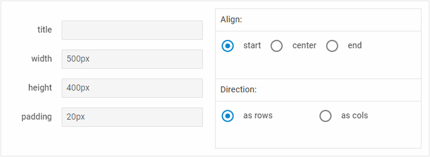

---
sidebar_label: Block
title: Block
---          

A control that allows you to combine a set of Form controls united by some common purpose.

{{sample form/02_configuration/12_blocks.html}}

Adding Block
------------

You can easily add a Block control during initialization of a form:

~~~js
{
	rows: [
    {
		title: "Align:",
		padding: "10px",
		cellCss: "dhx_layout-cell--bordered",
		cols: [{
			type: "radioButton",
			label: "start",
			name: "align",
			gravity: false,
			labelInline: true,
			value: "start",
			checked: true
		},
		{
        	type: "radioButton",
        	label: "center",
        	gravity: false,
        	name: "align",
        	labelInline: true,
        	value: "center"
		}
   	  ]},
      {
      	title: "Direction:",
      	cellCss: "dhx_layout-cell--bordered dhx_layout-cell--no-border_top",
      	padding: "10px",
      		cols: [
      			{
      				type: "radioButton",
                    label: "as rows",
                    name: "dir",
                    labelInline: true,
                    value: "rows",
                    checked: true
      			},
                {
                	type: "radioButton",
                	label: "as cols",
                	name: "dir",
                	labelInline: true,
                	value: "cols"
               	}
      	]}
    ]
}
~~~

###Attributes

You can provide the following attributes in the configuration object of a block:

- **type** - (*string*) the type of a control, set it to "block"
- **id** - (*string*) the id of a control, auto-generated if not set
- **cellCss** - (*string*) adds a CSS class(es) to the cell of Block
- **width** - (*string*) sets the width of Block
- **height** - (*string*) sets the height of Block
- **rows** - (*array*) arranges controls inside of Block vertically
- **cols** - (*array*) arranges controls inside of Block horizontally
- **group** - (*string*) combines several controls into a group, takes the type of control as its value, e.g. "input"
- **groupName** - (*string*) defines the name of a group of controls (used only for blocks with radio buttons that belong to one group)
- **title** - (*string*) specifies the title of Block 
- **align** - (*string*) sets the alignment of controls inside the block: "start" | "center" | "end" | "between" | "around" | "evenly" 
- **padding**  - (*string*) sets padding for controls inside a block 

