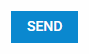

---
sidebar_label: Button
title: Button
---          

```todo

A simple button that can have an icon. Button can be *twoState* and can have a badge with a number, which can be useful for displaying the number of new messages, etc.



{{editor    https://snippet.dhtmlx.com/ikyyekxq	Form. All DhxForm Inputs}}

Adding Button 
------------

You can easily add a Button control during initialization of a form:

~~~js
var form = new dhx.Form("form_container", {
	rows: [
    	{
			type: "button",
            name: "button",
            text: "Send",
            size: "medium",
            view: "flat",
            color: "primary"
		}   
  	]
});
~~~


###Attributes

You can provide the following attributes in the configuration object of a button:

<table class="webixdoc_links">
	<tbody>
        <tr>
			<td class="webixdoc_links0"><b>type</b></td>
			<td>(<i>string</i>) the type of a control, set it to "button" </td>
		</tr>
		<tr>
			<td class="webixdoc_links0"><b>name</b></td>
			<td>(<i>string</i>) the name of a control </td>
		</tr>
		<tr>
			<td class="webixdoc_links0"><b>id</b></td>
			<td>(<i>string</i>) the id of a control, auto-generated if not set </td>
		</tr>
		<tr>
			<td class="webixdoc_links0"><b>text</b></td>
			<td>(<i>string</i>) the text label of a button </td>
		</tr>
		<tr>
			<td class="webixdoc_links0"><b>submit</b></td>
			<td>(<i>boolean</i>) enables the button to send form data to a server </td>
		</tr>
		<tr>
			<td class="webixdoc_links0"><b>url</b></td>
			<td>(<i>string</i>) the URL the post request with form data will be sent to (if the <b>submit</b> property is set to <i>true</i>)  <br>{{editor    https://snippet.dhtmlx.com/ikyyekxq	Form. All DhxForm Inputs}}</td>
		</tr>
		<tr>
			<td class="webixdoc_links0"><b>width</b></td>
			<td>(<i>string|number|"content"</i>) the width of a control </td>
		</tr>
		<tr>
			<td class="webixdoc_links0"><b>height</b></td>
			<td>(<i>string|number|"content"</i>) the height of a control </td>
		</tr>
		<tr>
			<td class="webixdoc_links0"><b>css</b></td>
			<td>(<i>string</i>) adds style classes to a control </td>
		</tr>
		<tr>
			<td class="webixdoc_links0"><b>disabled</b></td>
			<td>(<i>boolean</i>) defines whether a control is enabled (<i>false</i>) or disabled (<i>true</i>) </td>
		</tr>
		<tr>
			<td class="webixdoc_links0"><b>hidden</b></td>
			<td>(<i>boolean</i>) defines whether a control is hidden</td>
		</tr>
		<tr>
			<td class="webixdoc_links0"><b>icon</b></td>
			<td>(<i>string</i>) an <a href="https://docs.dhtmlx.com/suite/helpers__icon.html">icon</a> of the button</td>
		</tr>
		<tr>
			<td class="webixdoc_links0"><b>view</b></td>
			<td>(<i>string</i>) defines the look of a button: "flat"|"link"</td>
		</tr>
		<tr>
			<td class="webixdoc_links0"><b>size</b></td>
			<td>(<i>string</i>) defines the size of a button: "small"|"medium"</td>
		</tr>
		<tr>
			<td class="webixdoc_links0"><b>color</b></td>
			<td>(<i>string</i>) defines the color scheme of a button: "danger"|"secondary"|"primary"|"success"</td>
		</tr>
		<tr>
			<td class="webixdoc_links0"><b>full</b></td>
			<td>(<i>boolean</i>) extends a button to the full width of a form</td>
		</tr>
		<tr>
			<td class="webixdoc_links0"><b>circle</b></td>
			<td>(<i>boolean</i>) makes the corners of a button round</td>
		</tr>
		<tr>
			<td class="webixdoc_links0"><b>loading</b></td>
			<td>(<i>boolean</i>) adds a spinner into a button</td>
		</tr>
		<tr>
			<td class="webixdoc_links0"><b>padding</b></td>
			<td>(<i>string|number</i>) sets padding between a cell and a border of a button control</td>
		</tr>
    </tbody>
</table>


Working with Button
----------------------

You can manipulate a Button control by using methods (or [events](#eventhandling)) of the object returned by the [getItem()](form/api/form_getitem_method.md) method.

For example, you can disable a control on a page:

~~~js
form.getItem("button").disable();
~~~

###List of the control methods:


{{api

- form/api/button/button_disable_method.md - disables a Button control on a page
- form/api/button/button_enable_method.md - enables a disabled Button control
- form/api/button/button_getproperties_method.md - returns an object with the available configuration attributes of the control
- form/api/button/button_hide_method.md - hides a Button control
- form/api/button/button_isdisabled_method.md - checks whether a Button control is disabled
- form/api/button/button_isvisible_method.md - checks whether a Button control is visible on the page
- form/api/button/button_setproperties_method.md - allows changing available configuration attributes of the control dynamically
- form/api/button/button_show_method.md - shows a Button control on the page

}}


<h3 id="eventhandling">List of the control events:</h3>

{{api

- form/api/button/button_afterchangeproperties_event.md - fires after configuration attributes of the control have been changed dynamically
- form/api/button/button_afterhide_event.md - fires after a control is hidden
- form/api/button/button_aftershow_event.md - fires after a control is shown
- form/api/button/button_beforechangeproperties_event.md - fires before configuration attributes of the control are changed dynamically
- form/api/button/button_beforehide_event.md - fires before a control is hidden
- form/api/button/button_beforeshow_event.md - fires before a control is shown
- form/api/button/button_click_event.md - fires after a click on a button control
}}


@index:
- form/api/refs/button_methods.md
- form/api/refs/button_events.md

``` todo