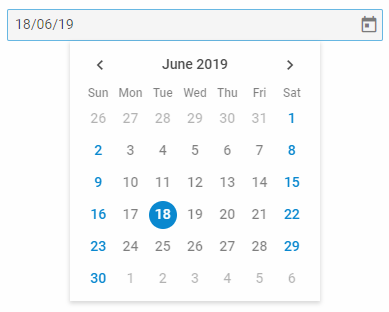

DatePicker
==============

An input with a calendar attached to it for selecting a date.

{{editor    https://snippet.dhtmlx.com/ikyyekxq	Form. All DhxForm Inputs}}

{{editor	https://snippet.dhtmlx.com/q3yk7e6s	Form. DatePicker}}

Adding DatePicker
------------

You can easily add a DatePicker control during initialization of a form:

~~~js
var form = new dhx.Form("form_container", {
    rows: [
		{
			type: "datepicker",
            name: "datepicker",
            label: "date",
            labelWidth: "50px"
		}
    ]
});
~~~

###Attributes

You can provide the following attributes in the configuration object of a DatePicker:

<table class="webixdoc_links">
	<tbody>
    <tr>
			<td class="webixdoc_links0"><b>type</b></td>
			<td>(<i>string</i>) the type of a control, set it to "datepicker"</td>
		</tr>
    <tr>
			<td class="webixdoc_links0"><b>name</b></td>
			<td>(<i>string</i>) the name of a control</td>
		</tr>
    <tr>
			<td class="webixdoc_links0"><b>id</b></td>
			<td>(<i>string</i>) the id of a control, auto-generated if not set</td>
		</tr>
    <tr>
			<td class="webixdoc_links0"><b>value</b></td>
			<td>(<i>Date|string</i>) the value of a datepicker</td>
		</tr>
    <tr>
			<td class="webixdoc_links0"><b>valueFormat</b></td>
			<td>(<i>string|Date</i>) defines the format of the value that will be returned while getting the current value of the control: "string" (default) or "Date"</td>
		</tr>
    <tr>
			<td class="webixdoc_links0"><b>width</b></td>
			<td>(<i>string|number|"content"</i>) the width of a control </td>
		</tr>
		<tr>
			<td class="webixdoc_links0"><b>height</b></td>
			<td>(<i>string|number|"content"</i>) the height of a control </td>
		</tr>
         <tr>
			<td class="webixdoc_links0"><b>padding</b></td>
			<td>(<i>string|number</i>) sets padding between a cell and a border of a DatePicker control</td>
		</tr>	
		<tr>
			<td class="webixdoc_links0"><b>css</b></td>
			<td>(<i>string</i>) adds style classes to a control </td>
		</tr>
		<tr>
			<td class="webixdoc_links0"><b>disabled</b></td>
			<td>(<i>boolean</i>) defines whether a control is enabled (<i>false</i>) or disabled (<i>true</i>) </td>
		</tr>
    <tr>
			<td class="webixdoc_links0"><b>required</b></td>
			<td>(<i>boolean</i>) <a href="https://docs.dhtmlx.com/suite/form__work_with_form.html#validatingform">defines whether a control is required</a> </td>
		</tr>
		<tr>
			<td class="webixdoc_links0"><b>hidden</b></td>
			<td>(<i>boolean</i>) defines whether a control is hidden</td>
		</tr>
    <tr>
			<td class="webixdoc_links0"><b>helpMessage</b></td>
			<td>(<i>string</i>) adds a help message to a control</td>
		</tr>
		<tr>
			<td class="webixdoc_links0"><b>preMessage</b></td>
			<td>(<i>string</i>) a message that contains instructions for interacting with the control</td>
		</tr>
		<tr>
			<td class="webixdoc_links0"><b>successMessage</b></td>
			<td>(<i>string</i>) a message that appears in case of successful validation of the control value</td>
		</tr>
		<tr>
			<td class="webixdoc_links0"><b>errorMessage</b></td>
			<td>(<i>string</i>) a message that appears in case of error during validation of the control value</td>
		</tr>
    <tr>
			<td class="webixdoc_links0"><b>label</b></td>
			<td>(<i>string</i>) specifies a label for a control</td>
		</tr>
    <tr>
			<td class="webixdoc_links0"><b>labelWidth</b></td>
			<td>(<i>string|number</i>) sets the width of the label of a control</td>
		</tr>
    <tr>
			<td class="webixdoc_links0"><b>hiddenLabel</b></td>
			<td>(<i>boolean</i>) invisible label that will be used to identify the input on the server side</td>
		</tr>
		<tr>
			<td class="webixdoc_links0"><b>labelPosition</b></td>
			<td>(<i>string</i>) defines the position of a label: "left"|"top"</td>
		</tr>
		<tr>
			<td class="webixdoc_links0"><b>validation</b></td>
			<td>(<i>function</i>) <a href="https://docs.dhtmlx.com/suite/form__work_with_form.html#validatingform">the validation function</a>, takes as a parameter the value to validate and returns <i>true/false</i> to indicate the result of validation</td>
		</tr>
		<tr>
			<td class="webixdoc_links0"><b>icon</b></td>
			<td>(<i>string</i>) the name of an <a href="https://docs.dhtmlx.com/suite/helpers__icon.html">icon</a> from the used icon font</td>
		</tr>
    <tr>
			<td class="webixdoc_links0"><b>placeholder</b></td>
			<td>(<i>string</i>) a tip for the input </td>
		</tr>
    <tr>
			<td class="webixdoc_links0"><b>editable</b></td>
			<td>(<i>boolean</i>) allows a user to enter the value of the control manually, false by default </td>
		</tr>
    <tr>
			<td class="webixdoc_links0"><b>mode</b></td>
			<td>(<i>string</i>) specifies the mode of displaying a calendar: "calendar" (default), "month", "year" </td>
		</tr>
    <tr>
			<td class="webixdoc_links0"><b>date</b></td>
			<td>(<i>Date|string</i>) defines the date that will be opened when the calendar is created, differs from the selected date (set by <b>value</b>) </td>
		</tr>
    <tr>
			<td class="webixdoc_links0"><b>mark</b></td>
			<td>(<i>function</i>) adds a CSS class to specific days </td>
		</tr>
    <tr>
			<td class="webixdoc_links0"><b>disabledDates</b></td>
			<td>(<i>function</i>) allows disabling some date intervals, day labels are dimmed </td>
		</tr>
    <tr>
			<td class="webixdoc_links0"><b>weekStart</b></td>
			<td>(<i>string</i>) sets the starting day of the week: "monday" or "sunday" (default) </td>
		</tr>
    <tr>
			<td class="webixdoc_links0"><b>weekNumbers</b></td>
			<td>(<i>boolean</i>) defines whether to show the numbers of weeks, <i>false</i> by default</td>
		</tr>
    <tr>
			<td class="webixdoc_links0"><b>timePicker</b></td>
			<td>(<i>boolean</i>) adds a timepicker into a calendar, <i>false</i> by default</td>
		</tr>
    <tr>
			<td class="webixdoc_links0"><b>timeFormat</b></td>
			<td>(<i>number</i>) defines the time format of a timepicker: 12-hour or 24-hour (12 or 24 (default), correspondingly)</td>
		</tr>
    <tr>
			<td class="webixdoc_links0"><b>dateFormat</b></td>
			<td>(<i>string</i>) defines the format of dates in the calendar, "%d/%m/%y" by default</td>
		</tr>
    <tr>
			<td class="webixdoc_links0"><b>thisMonthOnly</b></td>
			<td>(<i>boolean</i>) hides dates of the previous/next months relative to the currently displayed one</td>
		</tr>
    </tbody>
</table>

Working with DatePicker
----------------------

You can manipulate a DatePicker control by using methods (or [events](#eventhandling)) of the object returned by the [getItem()](form/api/form_getitem_method.md) method.

For example, you can get the value of the control:

~~~js
var value = form.getItem("datepicker").getValue();
// -> "03/06/19"

var value = form.getItem("datepicker").getValue(true);
// -> Mon Jun 03 2019 00:00:00 GMT+0300
~~~

###List of the control methods:

{{api

- form/api/calendar/calendar_clear_method.md - clears a value of a DatePicker control
- form/api/calendar/calendar_clearvalidate_method.md - clears validation of a DatePicker control
- form/api/calendar/calendar_disable_method.md - disables a DatePicker control on a page
- form/api/calendar/calendar_enable_method.md - enables a disabled DatePicker control
- form/api/calendar/calendar_focus_method.md - sets focus to a control
- form/api/calendar/calendar_getproperties_method.md - returns an object with the available configuration attributes of the control
- form/api/calendar/calendar_getvalue_method.md - returns the current value of a DatePicker control
- form/api/calendar/calendar_getwidget_method.md - returns the dhtmlxCalendar widget attached to a DatePicker control
- form/api/calendar/calendar_hide_method.md - hides a DatePicker control
- form/api/calendar/calendar_isdisabled_method.md - checks whether a DatePicker control is disabled
- form/api/calendar/calendar_isvisible_method.md - checks whether a DatePicker control is visible on the page
- form/api/calendar/calendar_setproperties_method.md - allows changing available configuration attributes of the control dynamically
- form/api/calendar/calendar_setvalue_method.md - sets a date in a DatePicker control
- form/api/calendar/calendar_show_method.md - shows a DatePicker control on the page
- form/api/calendar/calendar_validate_method.md - validates a DatePicker control
}}

<h3 id="eventhandling">List of the control events:</h3>

{{api
- form/api/calendar/calendar_afterchangeproperties_event.md - fires after configuration attributes of the control have been changed dynamically
- form/api/calendar/calendar_afterhide_event.md - fires after a control is hidden
- form/api/calendar/calendar_aftershow_event.md - fires after a control is shown
- form/api/calendar/calendar_aftervalidate_event.md - fires after the control value is validated
- form/api/calendar/calendar_beforechangeproperties_event.md - fires before configuration attributes of the control are changed dynamically
- form/api/calendar/calendar_beforehide_event.md - fires before a control is hidden
- form/api/calendar/calendar_beforeshow_event.md - fires before a control is shown
- form/api/calendar/calendar_beforevalidate_event.md - fires before the control value is validated
- form/api/calendar/calendar_change_event.md - fires on changing the value of a control
- form/api/calendar/calendar_input_event.md - fires when a user enters the value of a control in the input manually
}}

### Working with the dhtmlxCalendar widget

There is a possibility to use methods of dhtmlxCalendar via the **getWidget()** method of a DatePicker control.

For example, you can show the current month in the control. To do this, you need to get the widget attached to the DatePicker control and then use the [showDate()](calendar/api/calendar_showdate_method.md) method of this widget.

~~~js
var datepicker = form.getItem("datepicker").getWidget();  // -> dhtmlxCalendar
datepicker.showDate(null,"month"); // shows the current month
~~~

{{editor    https://snippet.dhtmlx.com/0aqkdsi7	Form. Get Widget Of Control}}

@index:
- form/api/refs/calendar_methods.md
- form/api/refs/calendar_events.md