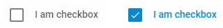

---
sidebar_label: Checkbox
title: Checkbox
---          

``` todo

A control that allows a user to make a choice between one or several opposite options by toggling them.



{{editor    https://snippet.dhtmlx.com/ikyyekxq	Form. All DhxForm Inputs}}

{{editor    https://snippet.dhtmlx.com/scs712zl	Form. Checkboxes}}

Adding Checkbox
------------

You can easily add a Checkbox control during initialization of a form:

~~~js
var form = new dhx.Form("form_container", {
    rows: [
		{	
			type: "checkbox",
            label: "I agree",
            name: "agree",
            id: "agree",
            value: "checkboxvalue"
		}
    ]
});
~~~


###Attributes

You can provide the following attributes in the configuration object of a Checkbox:

<table class="webixdoc_links">
	<tbody>
    <tr>
			<td class="webixdoc_links0"><b>type</b></td>
			<td>(<i>string</i>) the type of a control, set it to "checkbox"</td>
		</tr>
    <tr>
			<td class="webixdoc_links0"><b>name</b></td>
			<td>(<i>string</i>) the name of a control</td>
		</tr>
    <tr>
			<td class="webixdoc_links0"><b>id</b></td>
			<td>(<i>string</i>) the id of a control, auto-generated if not set</td>
		</tr>
    <tr>
			<td class="webixdoc_links0"><b>value</b></td>
			<td>(<i>string</i>) the value of a checkbox</td>
		</tr>
    <tr>
			<td class="webixdoc_links0"><b>checked</b></td>
			<td>(<i>boolean</i>) defines the initial state of a checkbox</td>
		</tr>
    <tr>
			<td class="webixdoc_links0"><b>width</b></td>
			<td>(<i>string|number|"content"</i>) the width of a control</td>
		</tr>
    <tr>
			<td class="webixdoc_links0"><b>height</b></td>
			<td>(<i>string|number|"content"</i>) the height of a control</td>
		</tr>
         <tr>
			<td class="webixdoc_links0"><b>padding</b></td>
			<td>(<i>string|number</i>) sets padding between a cell and a border of a Checkbox control</td>
		</tr>	
    <tr>
			<td class="webixdoc_links0"><b>css</b></td>
			<td>(<i>string</i>) adds style classes to a control</td>
		</tr>
    <tr>
			<td class="webixdoc_links0"><b>disabled</b></td>
			<td>(<i>boolean</i>) defines whether a control is enabled (<i>false</i>) or disabled (<i>true</i>)</td>
		</tr>
    <tr>
			<td class="webixdoc_links0"><b>hidden</b></td>
			<td>(<i>boolean</i>) defines whether a checkbox is hidden</td>
		</tr>
    <tr>
			<td class="webixdoc_links0"><b>required</b></td>
			<td>(<i>boolean</i>) <a href="https://docs.dhtmlx.com/suite/form__work_with_form.html#validatingform">defines whether a control is required</a></td>
		</tr>
	<tr>
			<td class="webixdoc_links0"><b>text</b></td>
			<td>(<i>string</i>) optional, the text value of a control. It's placed to the right of the control.</td>
		</tr>
    <tr>
			<td class="webixdoc_links0"><b>label</b></td>
			<td>(<i>string</i>) specifies a label for a control</td>
		</tr>
    <tr>
			<td class="webixdoc_links0"><b>hiddenLabel</b></td>
			<td>(<i>boolean</i>) invisible label that will be used to identify the input on the server side</td>
		</tr>
    <tr>
			<td class="webixdoc_links0"><b>labelPosition</b></td>
			<td>(<i>string</i>) defines the position of a label: "left"|"top"</td>
		</tr>
    <tr>
			<td class="webixdoc_links0"><b>labelWidth</b></td>
			<td>(<i>string|number</i>) sets the width of the label of a control</td>
		</tr>
    <tr>
			<td class="webixdoc_links0"><b>helpMessage</b></td>
			<td>(<i>string</i>) adds a help message to a control</td>
		</tr>
    <tr>
			<td class="webixdoc_links0"><b>preMessage</b></td>
			<td>(<i>string</i>) a message that contains instructions for interacting with the control</td>
		</tr>
    <tr>
			<td class="webixdoc_links0"><b>successMessage</b></td>
			<td>(<i>string</i>) a message that appears in case of successful validation of the control value</td>
		</tr>
    <tr>
			<td class="webixdoc_links0"><b>errorMessage</b></td>
			<td>(<i>string</i>) a message that appears in case of error during validation of the control value</td>
		</tr>
    </tbody>
</table>
<br>


Working with Checkbox
----------------------

You can manipulate a Checkbox control by using methods (or [events](#eventhandling)) of the object returned by the [getItem()](form/api/form_getitem_method.md) method.

For example, you can get the value of the control:

~~~js
var value = form.getItem("checkbox").getValue();
~~~

###List of the control methods:

{{api
- form/api/checkbox/checkbox_clear_method.md - clears a value of a Checkbox control
- form/api/checkbox/checkbox_clearvalidate_method.md - clears validation of a Checkbox control
- form/api/checkbox/checkbox_disable_method.md - disables a Checkbox control on a page
- form/api/checkbox/checkbox_enable_method.md - enables a disabled Checkbox control
- form/api/checkbox/checkbox_focus_method.md - sets focus to a control
- form/api/checkbox/checkbox_getproperties_method.md - returns an object with the available configuration attributes of the control
- form/api/checkbox/checkbox_getvalue_method.md - returns the current value/state of a Checkbox control
- form/api/checkbox/checkbox_hide_method.md - hides a Checkbox control
- form/api/checkbox/checkbox_ischecked_method.md - checks whether a Checkbox control is checked
- form/api/checkbox/checkbox_isdisabled_method.md - checks whether a Checkbox control is disabled
- form/api/checkbox/checkbox_isvisible_method.md - checks whether a Checkbox control is visible on the page
- form/api/checkbox/checkbox_setproperties_method.md - allows changing available configuration attributes of the control dynamically
- form/api/checkbox/checkbox_setvalue_method.md - sets the state for a Checkbox control
- form/api/checkbox/checkbox_show_method.md - shows a Checkbox control on the page
- form/api/checkbox/checkbox_validate_method.md - validates a Checkbox control
}}


<h3 id="eventhandling">List of the control events:</h3>

{{api
- form/api/checkbox/checkbox_afterchangeproperties_event.md - fires after configuration attributes of the control have been changed dynamically
- form/api/checkbox/checkbox_afterhide_event.md - fires after a control is hidden
- form/api/checkbox/checkbox_aftershow_event.md - fires after a control is shown
- form/api/checkbox/checkbox_aftervalidate_event.md - fires after the control value is validated
- form/api/checkbox/checkbox_beforechangeproperties_event.md - fires before configuration attributes of the control are changed dynamically
- form/api/checkbox/checkbox_beforehide_event.md - fires before a control is hidden
- form/api/checkbox/checkbox_beforeshow_event.md - fires before a control is shown
- form/api/checkbox/checkbox_beforevalidate_event.md - fires before the control value is validated
- form/api/checkbox/checkbox_change_event.md - fires on changing the value of a control

}}


@index:
- form/api/refs/checkbox_methods.md
- form/api/refs/checkbox_events.md

``` todo