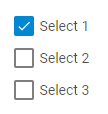

---
sidebar_label: CheckboxGroup
title: CheckboxGroup
---          

```todo

A control intended for creating groups of checkboxes.



{{sample	form/02_configuration/11_checkbox_group.html}}

Adding CheckboxGroup
------------

You can easily add a Checkbox control during initialization of a form:

~~~js
var form = new dhx.Form("form_container", { 
    rows: [
        {
			id: "checkboxGroup",
			type: "checkboxGroup",
			name: "checkboxGroup",
			required: true,
			label: "Checkbox Group",
			labelWidth: 140,
			labelPosition: "left",
			helpMessage: "Help information",
			padding: "50px",
			value: {
				first: true,
			},
			options: {
				padding: "50px",
				rows: [
					{
						id: "first",
						type: "checkbox",
						text: "Select 1",
					},
					{
						id: "second",
						type: "checkbox",
						text: "Select 2",
						checked: true
					}
				]
			}
		}
     ]
});
~~~


###Attributes

You can provide the following attributes in the configuration object of a CheckboxGroup:

<table class="webixdoc_links">
	<tbody>
    <tr>
			<td class="webixdoc_links0"><b>type</b></td>
			<td>(<i>string</i>) the type of a control, set it to "checkboxGroup"</td>
		</tr>
    <tr>
			<td class="webixdoc_links0"><b>name</b></td>
			<td>(<i>string</i>) the name of a control</td>
		</tr>
    <tr>
			<td class="webixdoc_links0"><b>id</b></td>
			<td>(<i>string</i>) the id of a control, auto-generated if not set</td>
		</tr>
		<tr>
			<td class="webixdoc_links0"><b>options</b></td>
			<td>(<i>object</i>) an object with options of a CheckboxGroup. The object can contain the following attributes:
				<ul>
					<li><b>width</b> - (<i>string|number|"content"</i>) the width of a CheckboxGroup</li>
					<li><b>height</b> - (<i>string|number|"content"</i>) the height of a CheckboxGroup</li>
					<li><b>padding</b> - (<i>string|number</i>) sets padding between a cell and a border of a CheckboxGroup</li>
					<li><b>css</b> - (<i>string</i>) adds style classes to a CheckboxGroup</li>
					<li><b>rows</b> - (<i>array</i>) arranges checkboxes inside the CheckboxGroup control vertically</li>
					<li><b>cols</b> - (<i>array</i>) arranges checkboxes inside the CheckboxGroup control horizontally</li>
				</ul>
			</td>
		</tr>
    <tr>
			<td class="webixdoc_links0"><b>value</b></td>
			<td>(<i>object</i>) the initial value of a CheckboxGroup. The value contain a set of <i>key:value</i> pairs where <i>key</i> is the id of a checkbox and <i>value</i> defines the initial state of the checkbox. The option has a higher priority than the <b>checked</b> attribute of a checkbox.</td>
		</tr>
    <tr>
			<td class="webixdoc_links0"><b>width</b></td>
			<td>(<i>string|number|"content"</i>) the width of a control</td>
		</tr>
    <tr>
			<td class="webixdoc_links0"><b>height</b></td>
			<td>(<i>string|number|"content"</i>) the height of a control</td>
		</tr>
    <tr>
			<td class="webixdoc_links0"><b>css</b></td>
			<td>(<i>string</i>) adds style classes to a control</td>
		</tr>
    <tr>
			<td class="webixdoc_links0"><b>disabled</b></td>
			<td>(<i>boolean</i>) defines whether a control is enabled (<i>false</i>) or disabled (<i>true</i>)</td>
		</tr>
    <tr>
			<td class="webixdoc_links0"><b>hidden</b></td>
			<td>(<i>boolean</i>) defines whether a CheckboxGroup is hidden</td>
		</tr>
    <tr>
			<td class="webixdoc_links0"><b>required</b></td>
			<td>(<i>boolean</i>) <a href="https://docs.dhtmlx.com/suite/form__work_with_form.html#validatingform">defines whether a control is required</a></td>
		</tr>
	 <tr>
			<td class="webixdoc_links0"><b>padding</b></td>
			<td>(<i>string|number</i>) sets padding between a cell and a border of a CheckboxGroup control</td>
		</tr>	
    <tr>
			<td class="webixdoc_links0"><b>label</b></td>
			<td>(<i>string</i>) specifies a label for a control</td>
		</tr>
    <tr>
			<td class="webixdoc_links0"><b>hiddenLabel</b></td>
			<td>(<i>boolean</i>) invisible label that will be used to identify the input on the server side</td>
		</tr>
    <tr>
			<td class="webixdoc_links0"><b>labelPosition</b></td>
			<td>(<i>string</i>) defines the position of a label: "left"|"top"</td>
		</tr>
    <tr>
			<td class="webixdoc_links0"><b>labelWidth</b></td>
			<td>(<i>string|number</i>) sets the width of the label of a control</td>
		</tr>
    <tr>
			<td class="webixdoc_links0"><b>helpMessage</b></td>
			<td>(<i>string</i>) adds a help message to a control</td>
		</tr>
    <tr>
			<td class="webixdoc_links0"><b>preMessage</b></td>
			<td>(<i>string</i>) a message that contains instructions for interacting with the control</td>
		</tr>
    <tr>
			<td class="webixdoc_links0"><b>successMessage</b></td>
			<td>(<i>string</i>) a message that appears in case of successful validation of the control value</td>
		</tr>
    <tr>
			<td class="webixdoc_links0"><b>errorMessage</b></td>
			<td>(<i>string</i>) a message that appears in case of error during validation of the control value</td>
		</tr>
    </tbody>
</table>
<br>

### Attributes of Checkbox

You can provide the following attributes in the configuration object of a checkbox:
<table class="webixdoc_links">
	<tbody>
		<tr>
			<td class="webixdoc_links0"><b>type</b></td>
			<td>(<i>string</i>) the type of a control, set it to "checkbox"</td>
		</tr>
		<tr>
			<td class="webixdoc_links0"><b>id</b></td>
			<td>(<i>string</i>) the id of a control, auto-generated if not set</td>
		</tr>
		<tr>
			<td class="webixdoc_links0"><b>value</b></td>
			<td>(<i>string</i>) the value of a checkbox</td>
		</tr>
		<tr>
			<td class="webixdoc_links0"><b>checked</b></td>
			<td>(<i>boolean</i>) defines the initial state of a checkbox</td>
		</tr>
		<tr>
			<td class="webixdoc_links0"><b>text</b></td>
			<td>(<i>string</i>) the text label of a checkbox</td>
		</tr>
		<tr>
			<td class="webixdoc_links0"><b>width</b></td>
			<td>(<i>string|number|"content"</i>) the width of a checkbox</td>
		</tr>
		<tr>
			<td class="webixdoc_links0"><b>height</b></td>
			<td>(<i>string|number|"content"</i>) the height of a checkbox</td>
		</tr>
		<tr>
			<td class="webixdoc_links0"><b>padding</b></td>
			<td>(<i>string|number</i>) sets padding between a cell and a border of a checkbox</td>
		</tr>
		<tr>
			<td class="webixdoc_links0"><b>css</b></td>
			<td>(<i>string</i>) adds style classes to a a checkbox</td>
		</tr>
		<tr>
			<td class="webixdoc_links0"><b>hidden</b></td>
			<td>(<i>boolean</i>) defines whether a checkbox is hidden</td>
		</tr>
	</tbody>
</table>
<br>

Working with CheckboxGroup
----------------------

You can manipulate a CheckboxGroup control by using methods (or [events](#eventhandling)) of the object returned by the [getItem()](form/api/form_getitem_method.md) method.

For example, you can hide a control on a page:

~~~js
var value = form.getItem("CheckboxGroup").hide();
~~~

###List of the control methods:

{{api
- form/api/checkbox_group/checkboxgroup_clear_method.md - clears a value of a CheckboxGroup control
- form/api/checkbox_group/checkboxgroup_clearvalidate_method.md - clears validation of a CheckboxGroup control
- form/api/checkbox_group/checkboxgroup_disable_method.md - disables a CheckboxGroup control on a page
- form/api/checkbox_group/checkboxgroup_enable_method.md - enables a disabled CheckboxGroup control
- form/api/checkbox_group/checkboxgroup_focus_method.md - sets focus to the checkbox of the Checkbox control by its id
- form/api/checkbox_group/checkboxgroup_getproperties_method.md - returns an object with the available configuration attributes of the control
- form/api/checkbox_group/checkboxgroup_getvalue_method.md - returns the current value/state of a checkbox(s)
- form/api/checkbox_group/checkboxgroup_hide_method.md - hides a CheckboxGroup control
- form/api/checkbox_group/checkboxgroup_ischecked_method.md - checks whether a checkbox of the CheckboxGroup control is checked
- form/api/checkbox_group/checkboxgroup_isdisabled_method.md - checks whether a CheckboxGroup control is disabled
- form/api/checkbox_group/checkboxgroup_isvisible_method.md - checks whether a CheckboxGroup control is visible on the page
- form/api/checkbox_group/checkboxgroup_setproperties_method.md - allows changing available configuration attributes of the control dynamically
- form/api/checkbox_group/checkboxgroup_setvalue_method.md - sets the value for a CheckboxGroup control
- form/api/checkbox_group/checkboxgroup_show_method.md - shows a CheckboxGroup control on the page
- form/api/checkbox_group/checkboxgroup_validate_method.md - validates a CheckboxGroup control
}}


<h3 id="eventhandling">List of the control events:</h3>

{{api
- form/api/checkbox_group/checkboxgroup_afterchangeproperties_event.md - fires after configuration attributes of the control have been changed dynamically
- form/api/checkbox_group/checkboxgroup_afterhide_event.md - fires after a control is hidden
- form/api/checkbox_group/checkboxgroup_aftershow_event.md - fires after a control is shown
- form/api/checkbox_group/checkboxgroup_aftervalidate_event.md - fires after the control value is validated
- form/api/checkbox_group/checkboxgroup_beforechangeproperties_event.md - fires before configuration attributes of the control are changed dynamically
- form/api/checkbox_group/checkboxgroup_beforehide_event.md - fires before a control is hidden
- form/api/checkbox_group/checkboxgroup_beforeshow_event.md - fires before a control is shown
- form/api/checkbox_group/checkboxgroup_beforevalidate_event.md - fires before the control value is validated
- form/api/checkbox_group/checkboxgroup_change_event.md - fires on changing the value of a control
}}


@index:
- form/api/refs/checkbox_group_methods.md
- form/api/refs/checkbox_group_events.md

``` todo