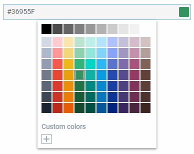

---
sidebar_label: ColorPicker
title: ColorPicker
---          

An input with a color picker attached to it for selecting a color.

https://snippet.dhtmlx.com/ikyyekxq	Form. All DhxForm Inputs

https://snippet.dhtmlx.com/n52dl19s	Form. ColorPicker

Adding ColorPicker
------------

You can easily add a ColorPicker control during initialization of a form:

~~~js
var form = new dhx.Form("form_container", {
    rows: [
		{
			type: "colorpicker",
            name: "colorpicker",
            labelWidth: "200px",
			label: "Choose your color"
		}
    ]
});
~~~

###Attributes

You can provide the following attributes in the configuration object of a ColorPicker:

<table class="webixdoc_links">
	<tbody>
        <tr>
			<td class="webixdoc_links0"><b>type</b></td>
			<td>(<i>string</i>) the type of a control, set it to "colorpicker"</td>
		</tr>
		<tr>
			<td class="webixdoc_links0"><b>name</b></td>
			<td>(<i>string</i>) the name of a control</td>
		</tr>
		<tr>
			<td class="webixdoc_links0"><b>id</b></td>
			<td>(<i>string</i>) the id of a control, auto-generated if not set</td>
		</tr>
		<tr>
			<td class="webixdoc_links0"><b>value</b></td>
			<td>(<i>string</i>) the value of a colorpicker</td>
		</tr>
		<tr>
			<td class="webixdoc_links0"><b>validation</b></td>
			<td>(<i>function</i>) <a href="https://docs.dhtmlx.com/suite/form__work_with_form.html#validatingform">the validation function</a>, takes as a parameter the value to validate and returns <i>true/false</i> to indicate the result of validation</td>
		</tr>
		<tr>
			<td class="webixdoc_links0"><b>width</b></td>
			<td>(<i>string|number|"content"</i>) the width of a control</td>
		</tr>
		<tr>
			<td class="webixdoc_links0"><b>height</b></td>
			<td>(<i>string|number|"content"</i>) the height of a control</td>
		</tr>
         <tr>
			<td class="webixdoc_links0"><b>padding</b></td>
			<td>(<i>string|number</i>) sets padding between a cell and a border of the ColorPicker control</td>
		</tr>	
		<tr>
			<td class="webixdoc_links0"><b>css</b></td>
			<td>(<i>string</i>) adds style classes to a control</td>
		</tr>
		<tr>
			<td class="webixdoc_links0"><b>icon</b></td>
			<td>(<i>string</i>) the name of an <a href="https://docs.dhtmlx.com/suite/helpers__icon.html">icon</a> from the used icon font</td>
		</tr>
		<tr>
			<td class="webixdoc_links0"><b>placeholder</b></td>
			<td>(<i>string</i>) a tip for the input</td>
		</tr>
		<tr>
			<td class="webixdoc_links0"><b>editable</b></td>
			<td>(<i>boolean</i>) allows a user to enter the value of the control manually</td>
		</tr>
		<tr>
			<td class="webixdoc_links0"><b>disabled</b></td>
			<td>(<i>boolean</i>) defines whether a control is enabled (<i>false</i>) or disabled (<i>true</i>)</td>
		</tr>
		<tr>
			<td class="webixdoc_links0"><b>required</b></td>
			<td>(<i>boolean</i>) <a href="https://docs.dhtmlx.com/suite/form__work_with_form.html#validatingform">defines whether a control is required</a></td>
		</tr>
		<tr>
			<td class="webixdoc_links0"><b>hidden</b></td>
			<td>(<i>boolean</i>) defines whether a control is hidden</td>
		</tr>
		<tr>
			<td class="webixdoc_links0"><b>label</b></td>
			<td>(<i>string</i>) specifies a label for a control</td>
		</tr>
		<tr>
			<td class="webixdoc_links0"><b>labelWidth</b></td>
			<td>(<i>string|number</i>) sets the width of the label of a control</td>
		</tr>
		<tr>
			<td class="webixdoc_links0"><b>hiddenLabel</b></td>
			<td>(<i>boolean</i>) invisible label that will be used to identify the input on the server side</td>
		</tr>
		<tr>
			<td class="webixdoc_links0"><b>labelPosition</b></td>
			<td>(<i>string</i>) defines the position of a label: "left"|"top"</td>
		</tr>
		<tr>
			<td class="webixdoc_links0"><b>helpMessage</b></td>
			<td>(<i>string</i>) adds a help message to a control</td>
		</tr>
		<tr>
			<td class="webixdoc_links0"><b>preMessage</b></td>
			<td>(<i>string</i>) a message that contains instructions for interacting with the control</td>
		</tr>
		<tr>
			<td class="webixdoc_links0"><b>successMessage</b></td>
			<td>(<i>string</i>) a message that appears in case of successful validation of the control value</td>
		</tr>
		<tr>
			<td class="webixdoc_links0"><b>errorMessage</b></td>
			<td>(<i>string</i>) a message that appears in case of error during validation of the control value</td>
		</tr>
		<tr>
			<td class="webixdoc_links0"><b>mode</b></td>
			<td>(<i>string</i>) the mode of a control: "palette" (default), "picker"</td>
		</tr>
		<tr>
			<td class="webixdoc_links0"><b>palette</b></td>
			<td>(<i>array</i>) contains arrays of colors you want to be shown in a colorpicker</td>
		</tr>
		<tr>
			<td class="webixdoc_links0"><b>paletteOnly</b></td>
			<td>(<i>boolean</i>) defines whether ColorPicker is shown only the palette mode</td>
		</tr>
		<tr>
			<td class="webixdoc_links0"><b>pickerOnly</b></td>
			<td>(<i>boolean</i>) defines whether ColorPicker is shown only the picker mode</td>
		</tr>
		<tr>
			<td class="webixdoc_links0"><b>customColors</b></td>
			<td>(<i>array</i>) shows a section with custom colors in the bottom part of the ColorPicker</td>
		</tr>
		<tr>
			<td class="webixdoc_links0"><b>grayShades</b></td>
			<td>(<i>boolean</i>) defines whether the section with gray shades is displayed in the palette</td>
		</tr>
    </tbody>
</table>

Working with ColorPicker
----------------------

You can manipulate a ColorPicker control by using methods (or [events](#eventhandling)) of the object returned by the [getItem()](/form/api/form_getitem_method) method.

For example, you can get the value of the control:

~~~js
var value = form.getItem("colorpicker").getValue();
~~~

https://snippet.dhtmlx.com/ocfas6go	Form. Get Item

###List of the control methods:

{{api
- form/api/colorpicker/colorpicker_clear_method.md - clears a value of a ColorPicker control
- form/api/colorpicker/colorpicker_clearvalidate_method.md - clears validation of a ColorPicker control
- form/api/colorpicker/colorpicker_disable_method.md - disables a ColorPicker control on a page
- form/api/colorpicker/colorpicker_enable_method.md - enables a disabled ColorPicker control
- form/api/colorpicker/colorpicker_focus_method.md - sets focus to a control
- form/api/colorpicker/colorpicker_getproperties_method.md - returns an object with the available configuration attributes of the control
- form/api/colorpicker/colorpicker_getvalue_method.md - returns the current value of a ColorPicker control (in the Hex format)
- form/api/colorpicker/colorpicker_getwidget_method.md - returns the dhtmlxColorPicker widget attached to a ColorPicker control
- form/api/colorpicker/colorpicker_hide_method.md - hides a ColorPicker control
- form/api/colorpicker/colorpicker_isdisabled_method.md - checks whether a ColorPicker control is disabled
- form/api/colorpicker/colorpicker_isvisible_method.md - checks whether a ColorPicker control is visible on the page
- form/api/colorpicker/colorpicker_setproperties_method.md - allows changing available configuration attributes of the control dynamically
- form/api/colorpicker/colorpicker_setvalue_method.md - sets the value as a string (in the Hex format) for a ColorPicker control
- form/api/colorpicker/colorpicker_show_method.md - shows a ColorPicker control on the page
- form/api/colorpicker/colorpicker_validate_method.md - validates a ColorPicker control
}}

<h3 id="eventhandling">List of the control events:</h3>

{{api
- form/api/colorpicker/colorpicker_afterchangeproperties_event.md - fires after configuration attributes of the control have been changed dynamically
- form/api/colorpicker/colorpicker_afterhide_event.md - fires after a control is hidden
- form/api/colorpicker/colorpicker_aftershow_event.md - fires after a control is shown
- form/api/colorpicker/colorpicker_aftervalidate_event.md - fires after the control value is validated
- form/api/colorpicker/colorpicker_beforechangeproperties_event.md - fires before configuration attributes of the control are changed dynamically
- form/api/colorpicker/colorpicker_beforehide_event.md - fires before a control is hidden
- form/api/colorpicker/colorpicker_beforeshow_event.md - fires before a control is shown
- form/api/colorpicker/colorpicker_beforevalidate_event.md - fires before the control value is validated
- form/api/colorpicker/colorpicker_change_event.md - fires on changing the value of a control
- form/api/colorpicker/colorpicker_input_event.md - fires when a user enters the value of a control in the input manually
}}

### Working with the dhtmlxColorPicker widget

There is a possibility to use methods of dhtmlxColorPicker via the <strong>getWidget()</strong> method of a ColorPicker control.

For example, you can set focus on the specified value in the control. To do this, you need to get the widget attached to the ColorPicker control and then use the [setFocus()](/colorpicker/api/colorpicker_setfocus_method) method of this widget.

~~~js
var colorpicker = form.getItem("colorpicker").getWidget();  // -> ColorPicker
colorpicker.setFocus("#BDF0E9"); // sets focus on the "#BDF0E9" color
~~~

https://snippet.dhtmlx.com/0aqkdsi7	Form. Get Widget Of Control

- form/api/refs/colorpicker_methods.md
- form/api/refs/colorpicker_events.md