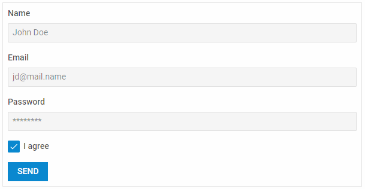

---
sidebar_label: Overview
title: Form overview
description: dhtmlxForm is a useful widget integrated with other DHTMLX components and intended to view and edit data, validate them and send to a server side.  
---          


dhtmlxForm is a typical form widget that can contain a number of adjustable and easy-to-use controls, supports data validation and localization of labels.
Check [online samples for dhtmlxForm](https://docs.dhtmlx.com/suite/samples/form/). 



## API reference

- form/api/refs/form.md

## Related resources

- You can get dhtmlxForm as a part of the Suite library by [downloading dhtmlxSuite](https://dhtmlx.com/docs/products/dhtmlxSuite/download.shtml)          
- There are also [online samples for dhtmlxForm](https://docs.dhtmlx.com/suite/samples/form/)  

## Guides
``` todo
<table class='guide-table'>
	<tbody>
	<tr>
		<td id="data" class='topics'>
		    <h4>
		        Working with Form
		    </h4>
		    <ul id="data_sublist" >
            	<li>form/how_to_start.md</li>            		       	
            	<li>form/controls_list.md</li>                  
				<li>form/localization.md</li>
				<li>form/configuration.md</li>
                <li>form/work_with_form.md</li>
                <li>form/customization.md</li>
                <li>form/handling_events.md</li>
            </ul>
        </td>
        <td class='topic_description'>Guides you through common information you may need while working with Form.</td>
    </tr>
   	<tr>
		<td id="manipulations" class='topics'>
		    <h4>
		        Form Controls
		    </h4>
		    <ul id="manipulations_sublist">                 	
				<li>form/button.md</li>
				<li>form/calendar.md</li>
				<li>form/checkbox.md</li>
				<li>form/checkboxgroup.md</li>
                <li>form/colorpicker.md</li>
				<li>form/combo.md</li>
				<li>form/input.md</li>
				<li>form/radiogroup.md</li>
				<li>form/select.md</li>
				<li>form/simplevault.md</li>
				<li>form/slider.md</li>
                <li>form/text.md</li>
				<li>form/textarea.md</li>
				<li>form/timepicker.md</li>               
            </ul>
        </td>
		<td class='topic_description'>Discusses the creation of Form controls and the possibilities of manipulating them.</td>
    </tr>
   	</tbody>
</table>

## Other

- [](../migration.md)
```
