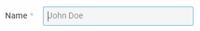

---
sidebar_label: Input
title: Input
---          

An input field for typing some text inside.

{{editor    https://snippet.dhtmlx.com/ikyyekxq	Form. All DhxForm Inputs}}

{{editor	https://snippet.dhtmlx.com/9q8fubjm	Form. Inputs}}

Adding Input 
------------

You can easily add an Input control during initialization of a form:

~~~js
var form = new dhx.Form("form_container", {
	rows: [
    	{
			type: "input",
            name: "input",
            label: "Name",
            icon: "dxi dxi-magnify",
            placeholder: "John Doe"           
	 	} 
    ]
});
~~~

###Attributes

You can provide the following attributes in the configuration object of an input:

<table class="webixdoc_links">
	<tbody>
    	<tr>
			<td class="webixdoc_links0"><b>type</b></td>
			<td>(<i>string</i>) the type of a control, set it to "input" </td>
		</tr>
        <tr>
			<td class="webixdoc_links0"><b>inputType</b></td>
			<td>(<i>string</i>) sets the type of an input: "text", "password", "number".  Using the "number" type for the input sets the type of the <b>value</b> attribute to "number".  Use the "password" value to specify a field for entering a password.</td>
		</tr>
        <tr>
			<td class="webixdoc_links0"><b>name</b></td>
			<td>(<i>string</i>) the name of a control</td>
		</tr>
        <tr>
			<td class="webixdoc_links0"><b>id</b></td>
			<td>(<i>string</i>) the id of a control, auto-generated if not set</td>
		</tr>
        <tr>
			<td class="webixdoc_links0"><b>value</b></td>
			<td>(<i>string|number</i>) the initial value of the input</td>
		</tr>
		<tr>
			<td class="webixdoc_links0"><b>min</b></td>
			<td>(<i>string|number</i>) <a href="https://docs.dhtmlx.com/suite/form__work_with_form.html#validatingform">the minimal value allowed in the input</a>.  The attribute works only with the input type: "number". </td>
		</tr>
		<tr>
			<td class="webixdoc_links0"><b>max</b></td>
			<td>(<i>string|number</i>) <a href="https://docs.dhtmlx.com/suite/form__work_with_form.html#validatingform">the maximal value allowed in the input</a>.  The attribute works only with the input type: "number". </td>
		</tr>
        <tr>
			<td class="webixdoc_links0"><b>validation</b></td>
			<td>(<i>string|function</i>) <a href="https://docs.dhtmlx.com/suite/form__work_with_form.html#validatingform">the rule of input validation</a>. Can be set in two ways:
            	<ul>
                	<li>as a predefined string value: 
                    <ol>- "email" - validEmail</ol>
                    <ol>- "integer" - validInteger</ol>
                    <ol>- "numeric" - validNumeric</ol>
                    <ol>- "alphanumeric" - validAplhaNumeric</ol>
                    <ol>- "IPv4" - validIPv4</ol>
					Can be used with <i>inputType: "text", "password"</i>.
                    </li>
                    <li>as a <i>function</i> that defines a custom validation rule. It takes as a parameter the value typed in the input and returns <i>true</i>, if the entered value is valid.  Can be used with <i>inputType: "number"</i> only.</li>
                </ul>
            </td>
		</tr>
        <tr>
			<td class="webixdoc_links0"><b>width</b></td>
			<td>(<i>string|number|"content"</i>) the width of a control</td>
		</tr>
        <tr>
			<td class="webixdoc_links0"><b>height</b></td>
			<td>(<i>string|number|"content"</i>) the height of a control</td>
		</tr>
         <tr>
			<td class="webixdoc_links0"><b>padding</b></td>
			<td>(<i>string|number</i>) sets padding between a cell and a border of the Input control</td>
		</tr>
		<tr>
			<td class="webixdoc_links0"><b>minlength</b></td>
			<td>(<i>string|number</i>) the minimum <a href="https://docs.dhtmlx.com/suite/form__work_with_form.html#validatingform">number of characters allowed in the input</a>.   The attribute works with the following input types: "text", "password". </td>
		</tr>
		<tr>
			<td class="webixdoc_links0"><b>maxlength</b></td>
			<td>(<i>string|number</i>) the maximum <a href="https://docs.dhtmlx.com/suite/form__work_with_form.html#validatingform">number of characters allowed in the input</a>.  The attribute works with the following input types: "text", "password".</td>
		</tr>	
        <tr>
			<td class="webixdoc_links0"><b>css</b></td>
			<td>(<i>string</i>) adds style classes to a control</td>
		</tr>
        <tr>
			<td class="webixdoc_links0"><b>disabled</b></td>
			<td>(<i>boolean</i>) defines whether a control is enabled (<i>false</i>) or disabled (<i>true</i>)</td>
		</tr>
        <tr>
			<td class="webixdoc_links0"><b>required</b></td>
			<td>(<i>boolean</i>) <a href="https://docs.dhtmlx.com/suite/form__work_with_form.html#validatingform">defines whether a control is required</a></td>
		</tr>
        <tr>
			<td class="webixdoc_links0"><b>readOnly</b></td>
			<td>(<i>boolean</i>) defines whether an input is readonly</td>
		</tr>
        <tr>
			<td class="webixdoc_links0"><b>hidden</b></td>
			<td>(<i>boolean</i>) makes an input hidden</td>
		</tr>
        <tr>
			<td class="webixdoc_links0"><b>icon</b></td>
			<td>(<i>string</i>) the name of an <a href="https://docs.dhtmlx.com/suite/helpers__icon.html">icon</a> from the used icon font</td>
		</tr>
        <tr>
			<td class="webixdoc_links0"><b>placeholder</b></td>
			<td>(<i>string</i>) a tip for the input</td>
		</tr>
        <tr>
			<td class="webixdoc_links0"><b>autocomplete</b></td>
			<td>(<i>boolean</i>) enables/disables the autocomplete functionality of the input</td>
		</tr>
        <tr>
			<td class="webixdoc_links0"><b>label</b></td>
			<td>(<i>string</i>) specifies a label for a control</td>
		</tr>
        <tr>
			<td class="webixdoc_links0"><b>labelWidth</b></td>
			<td>(<i>string|number</i>) sets the width of the label of a control</td>
		</tr>
        <tr>
			<td class="webixdoc_links0"><b>hiddenLabel</b></td>
			<td>(<i>boolean</i>) invisible label that will be used to identify the input on the server side</td>
		</tr>
        <tr>
			<td class="webixdoc_links0"><b>labelPosition</b></td>
			<td>(<i>string</i>) defines the position of a label: "left"|"top"</td>
		</tr>
        <tr>
			<td class="webixdoc_links0"><b>helpMessage</b></td>
			<td>(<i>string</i>) adds a help message to a control</td>
		</tr>
        <tr>
			<td class="webixdoc_links0"><b>preMessage</b></td>
			<td>(<i>string</i>) a message that contains instructions for interacting with the control</td>
		</tr>
        <tr>
			<td class="webixdoc_links0"><b>successMessage</b></td>
			<td>(<i>string</i>) a message that appears in case of successful validation of the control value</td>
		</tr>
        <tr>
			<td class="webixdoc_links0"><b>errorMessage</b></td>
			<td>(<i>string</i>) a message that appears in case of error during validation of the control value</td>
		</tr>
    </tbody>
</table>

Working with Input
----------------------

You can manipulate a Input control by using methods (or [events](#eventhandling)) of the object returned by the [getItem()](form/api/form_getitem_method.md) method.

For example, you can get the value of the control:

~~~js
var value = form.getItem("input").getValue();
~~~

###List of the control methods:

{{api
- form/api/input/input_clear_method.md - clears a value of an Input control
- form/api/input/input_clearvalidate_method.md - clears validation of an Input control
- form/api/input/input_disable_method.md - disables an Input control on a page
- form/api/input/input_enable_method.md - enables a disabled Input control
- form/api/input/input_focus_method.md - sets focus to a control
- form/api/input/input_getproperties_method.md - returns an object with the available configuration attributes of the control
- form/api/input/input_getvalue_method.md - returns the current value of an Input control
- form/api/input/input_hide_method.md - hides an Input control
- form/api/input/input_isdisabled_method.md - checks whether an Input control is disabled
- form/api/input/input_isvisible_method.md - checks whether an Input control is visible on the page
- form/api/input/input_setproperties_method.md - allows changing available configuration attributes of the control dynamically
- form/api/input/input_setvalue_method.md - sets the value for an Input control
- form/api/input/input_show_method.md - shows an Input control on the page
- form/api/input/input_validate_method.md - validates an Input control
}}

<h3 id="eventhandling">List of the control events:</h3>

{{api
- form/api/input/input_afterchangeproperties_event.md - fires after configuration attributes of the control have been changed dynamically
- form/api/input/input_afterhide_event.md - fires after a control is hidden
- form/api/input/input_aftershow_event.md - fires after a control is shown
- form/api/input/input_aftervalidate_event.md - fires after the control value is validated
- form/api/input/input_beforechangeproperties_event.md - fires before configuration attributes of the control are changed dynamically
- form/api/input/input_beforehide_event.md - fires before a control is hidden
- form/api/input/input_beforeshow_event.md - fires before a control is shown
- form/api/input/input_beforevalidate_event.md - fires before the control value is validated
- form/api/input/input_change_event.md - fires on changing the value of a control
- form/api/input/input_input_event.md - fires when a user types some text in the input
}}

@index:
- form/api/refs/input_methods.md
- form/api/refs/input_events.md

