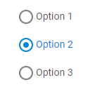

---
sidebar_label: RadioGroup
title: RadioGroup
---          

A control intended for creating groups of Radio buttons.

{{editor    https://snippet.dhtmlx.com/ikyyekxq	Form. All DhxForm Inputs}}

{{editor	https://snippet.dhtmlx.com/ycp1cbct	Form. Radio Buttons}}

{{editor	https://snippet.dhtmlx.com/1pzybtja	Form. Blocks}}

Adding RadioGroup
-----------------

You can easily add a RadioGroup control during initialization of a form:

~~~js
var form = new dhx.Form("form_container", {	
	rows: [
    	{
			id: "radiogroup",
            name: "radiogroup",
			type: "radioGroup",
			required: true,
			label: "Radio Group",
			labelWidth: 140,
			labelPosition: "left",
			helpMessage: " Help information",
			value: "1",
			options: {
				rows: [
					{
						type: "radioButton",
						text: "Select 1",
						value: "1",
					},
					{
						type: "radioButton",
						text: "Select 2",
						value: "2"
					},
				]
			}
		}
     ]
});
~~~

### Attributes of RadioGroup

You can provide the following attributes in the configuration object of a RadioGroup:

<table class="webixdoc_links">
	<tbody>
        <tr>
			<td class="webixdoc_links0"><b>type</b></td>
			<td>(<i>string</i>) the type of a control, set it to "radioGroup"</td>
		</tr>
		<tr>
			<td class="webixdoc_links0"><b>name</b></td>
			<td>(<i>string</i>) the name of a control</td>
		</tr>
		<tr>
			<td class="webixdoc_links0"><b>id</b></td>
			<td>(<i>string</i>) the id of a control, auto-generated if not set</td>
		</tr>
		<tr>
			<td class="webixdoc_links0"><b>options</b></td>
			<td>(<i>object</i>) an object with options of a RadioGroup. The object can contain the following attributes:
				<ul>
					<li><b>width</b> - (<i>string|number|"content"</i>) the width of a RadioGroup</li>
					<li><b>height</b> - (<i>string|number|"content"</i>) the height of a RadioGroup </li>
					<li><b>padding</b> - (<i>string|number</i>) sets padding between a cell and a border of a RadioGroup</li>
					<li><b>css</b> - (<i>string</i>) adds style classes to a RadioGroup</li>
					<li><b>rows</b> - (<i>array</i>) arranges radio buttons inside the RadioGroup control vertically</li>
					<li><b>cols</b> - (<i>array</i>) arranges radio buttons inside the RadioGroup control horizontally</li>
				</ul></td>
		</tr>
		<tr>
			<td class="webixdoc_links0"><b>value</b></td>
			<td>(<i>string</i>) the initial value of a RadioGroup. The option has a higher priority than the <b>checked</b> attribute of a RadioButton</td>
		</tr>
		<tr>
			<td class="webixdoc_links0"><b>width</b></td>
			<td>(<i>string|number|"content"</i>) the width of a control</td>
		</tr>
		<tr>
			<td class="webixdoc_links0"><b>height</b></td>
			<td>(<i>string|number|"content"</i>) the height of a control</td>
		</tr>
			<tr>
			<td class="webixdoc_links0"><b>padding</b></td>
			<td>(<i>string|number</i>) sets padding between a cell and a border of a RadioGroup control</td>
		</tr>
		<tr>
			<td class="webixdoc_links0"><b>css</b></td>
			<td>(<i>string</i>) adds style classes to a control</td>
		</tr>
		<tr>
			<td class="webixdoc_links0"><b>disabled</b></td>
			<td>(<i>boolean</i>) defines whether a control is enabled (<i>false</i>) or disabled (<i>true</i>)</td>
		</tr>
		<tr>
			<td class="webixdoc_links0"><b>hidden</b></td>
			<td>(<i>boolean</i>) defines whether a RadioGroup is hidden</td>
		</tr>
		<tr>
			<td class="webixdoc_links0"><b>required</b></td>
			<td>(<i>boolean</i>) <a href="https://docs.dhtmlx.com/suite/form__work_with_form.html#validatingform">defines whether a control is required</a></td>
		</tr>
		<tr>
			<td class="webixdoc_links0"><b>label</b></td>
			<td>(<i>string</i>) specifies a label for a control</td>
		</tr>
    <tr>
			<td class="webixdoc_links0"><b>hiddenLabel</b></td>
			<td>(<i>boolean</i>) invisible label that will be used to identify the input on the server side</td>
		</tr>
    <tr>
			<td class="webixdoc_links0"><b>labelPosition</b></td>
			<td>(<i>string</i>) defines the position of a label: "left"|"top"</td>
		</tr>
    <tr>
			<td class="webixdoc_links0"><b>labelWidth</b></td>
			<td>(<i>string|number</i>) sets the width of the label of a control</td>
		</tr>
    <tr>
			<td class="webixdoc_links0"><b>helpMessage</b></td>
			<td>(<i>string</i>) adds a help message to a control</td>
		</tr>
		<tr>
			<td class="webixdoc_links0"><b>preMessage</b></td>
			<td>(<i>string</i>) a message that contains instructions for interacting with the control, applied for all radio buttons in a group</td>
		</tr>
		<tr>
			<td class="webixdoc_links0"><b>successMessage</b></td>
			<td>(<i>string</i>) a message that appears in case of successful validation of the control value, applied for all radio buttons in a group</td>
		</tr>
		<tr>
			<td class="webixdoc_links0"><b>errorMessage</b></td>
			<td>(<i>string</i>) a message that appears in case of error during validation of the control value, applied for all radio buttons in a group</td>
		</tr>
    </tbody>
</table>

### Attributes of RadioButton

You can provide the following attributes in the configuration object of a radio button:

<table class="webixdoc_links">
	<tbody>
        <tr>
			<td class="webixdoc_links0"><b>type</b></td>
			<td>(<i>string</i>) the type of a control, set it to "radioButton"</td>
		</tr>
		<tr>
			<td class="webixdoc_links0"><b>id</b></td>
			<td>(<i>string</i>) the id of a control, auto-generated if not set</td>
		</tr>
		<tr>
			<td class="webixdoc_links0"><b>checked</b></td>
			<td>(<i>boolean</i>) defines the initial state of a radio button, only one radio button can be checked at a time</td>
		</tr>
		<tr>
			<td class="webixdoc_links0"><b>hidden</b></td>
			<td>(<i>boolean</i>) defines whether a radio button is hidden</td>
		</tr>
		<tr>
			<td class="webixdoc_links0"><b>value</b></td>
			<td>(<i>string</i>) mandatory, the value of a radioButton</td>
		</tr>
			<tr>
			<td class="webixdoc_links0"><b>text</b></td>
			<td>(<i>string</i>) the text label of a radio button</td>
		</tr>
		<tr>
			<td class="webixdoc_links0"><b>width</b></td>
			<td>(<i>string|number|"content"</i>) the width of a control</td>
		</tr>
		<tr>
			<td class="webixdoc_links0"><b>height</b></td>
			<td>(<i>string|number|"content"</i>) the height of a control</td>
		</tr>
		<tr>
			<td class="webixdoc_links0"><b>padding</b></td>
			<td>(<i>string|number</i>) sets padding between a cell and a border of a radio button</td>
		</tr>
		<tr>
			<td class="webixdoc_links0"><b>css</b></td>
			<td>(<i>string</i>) adds style classes to a control</td>
		</tr>
    </tbody>
</table>

Working with RadioGroup
----------------------

You can manipulate a RadioGroup control by using methods (or [events](#eventhandling)) of the object returned by the [getItem()](form/api/form_getitem_method.md) method.

For example, you can get the value of the control:

~~~js
var value = form.getItem("radiogroup").getValue();
~~~

###List of the control methods:

{{api
- form/api/radiogroup/radiogroup_clear_method.md - clears a value of a RadioGroup control
- form/api/radiogroup/radiogroup_clearvalidate_method.md - clears validation of a RadioGroup control
- form/api/radiogroup/radiogroup_disable_method.md - disables a RadioGroup control on a page
- form/api/radiogroup/radiogroup_enable_method.md - enables a disabled RadioGroup control
- form/api/radiogroup/radiogroup_focus_method.md - sets focus to the radio button of the RadioGroup control by its id
- form/api/radiogroup/radiogroup_getproperties_method.md - returns an object with the available configuration attributes of the control
- form/api/radiogroup/radiogroup_getvalue_method.md - returns the current value of a RadioGroup control
- form/api/radiogroup/radiogroup_hide_method.md - hides a RadioGroup control
- form/api/radiogroup/radiogroup_isdisabled_method.md - checks whether a RadioGroup control is disabled
- form/api/radiogroup/radiogroup_isvisible_method.md - checks whether a RadioGroup control is visible on the page
- form/api/radiogroup/radiogroup_setproperties_method.md - allows changing available configuration attributes of the control dynamically
- form/api/radiogroup/radiogroup_setvalue_method.md - sets the value for a RadioGroup control
- form/api/radiogroup/radiogroup_show_method.md - shows a RadioGroup control on the page
- form/api/radiogroup/radiogroup_validate_method.md - validates a RadioGroup control
}}

<h3 id="eventhandling">List of the control events:</h3>

{{api
- form/api/radiogroup/radiogroup_afterchangeproperties_event.md - fires after configuration attributes of the control have been changed dynamically
- form/api/radiogroup/radiogroup_afterhide_event.md - fires after a control is hidden
- form/api/radiogroup/radiogroup_aftershow_event.md - fires after a control is shown
- form/api/radiogroup/radiogroup_aftervalidate_event.md - fires after the control value is validated
- form/api/radiogroup/radiogroup_beforechangeproperties_event.md - fires before configuration attributes of the control are changed dynamically
- form/api/radiogroup/radiogroup_beforehide_event.md - fires before a control is hidden
- form/api/radiogroup/radiogroup_beforeshow_event.md - fires before a control is shown
- form/api/radiogroup/radiogroup_beforevalidate_event.md - fires before the control value is validated
- form/api/radiogroup/radiogroup_change_event.md - fires on changing the value of a control
}}

@index:
- form/api/refs/radiogroup_methods.md
- form/api/refs/radiogroup_events.md