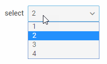

Select
==========

An advanced select box that provides a set of options to choose from.

{{editor    https://snippet.dhtmlx.com/ikyyekxq	Form. All DhxForm Inputs}}

{{editor	https://snippet.dhtmlx.com/yo9w9o2t	Form. Select}}

Adding Select
------------

You can easily add a Select control during initialization of a form:

~~~js
var form = new dhx.Form("form_container", {
	rows: [
    	{
        	type: "select",
            name: "select",
        	label: "select",
        	labelWidth: "50px",
        	width:"200px",
        	options: [
        		{
        			value: "1",
        			content: "1",
					disabled: true
        		},
        		{
        			value: "2",
        			content: "2"
        		},
        		{
        			value: "3",
        			content: "3"
        		},
        		{
        			value: "4",
        			content: "4"
        		}
        	]        
        }  
    ]
});
~~~

###Attributes

You can provide the following attributes in the configuration object of a select:

<table class="webixdoc_links">
	<tbody>
    	<tr>
			<td class="webixdoc_links0"><b>type</b></td>
			<td>(<i>string</i>) the type of a control, set it to "select" </td>
		</tr>
		<tr>
			<td class="webixdoc_links0"><b>name</b></td>
			<td>(<i>string</i>) the name of a control </td>
		</tr>
		<tr>
			<td class="webixdoc_links0"><b>id</b></td>
			<td>(<i>string|number</i>) the id of a control, auto-generated if not set </td>
		</tr>
       	<tr>
			<td class="webixdoc_links0"><b>options</b></td>
			<td>(<i>array</i>) an array of Select options, each option is an object with a set of <i>key:value</i> pairs - attributes of options and their values:
            	<ul>
                	<li><b>value</b> - (<i>string|number</i>) mandatory, sets the value for the select option</li>
                    <li><b>content</b> - (<i>string</i>) mandatory, the content displayed in the select option</li>
					<li><b>disabled</b> - (<i>boolean</i>) optional, defines whether the option is enabled (<i>false</i>) or disabled (<i>true</i>) </li>
                </ul>
            </td>
		</tr>
		<tr>
			<td class="webixdoc_links0"><b>value</b></td>
			<td>(<i>string/number</i>) the initial value of the select control </td>
		</tr>
		<tr>
			<td class="webixdoc_links0"><b>validation</b></td>
			<td>(<i>function</i>) <a href="https://docs.dhtmlx.com/suite/form__work_with_form.html#validatingform">the validation function</a>, takes as a parameter the value to validate and returns <i>true/false</i> to indicate the result of validation</td>
		</tr>
		<tr>
			<td class="webixdoc_links0"><b>icon</b></td>
			<td>(<i>string</i>) the name of an <a href="https://docs.dhtmlx.com/suite/helpers__icon.html">icon</a> from the used icon font</td>
		</tr>
		<tr>
			<td class="webixdoc_links0"><b>width</b></td>
			<td>(<i>string|number|"content"</i>) the width of a control</td>
		</tr>
		<tr>
			<td class="webixdoc_links0"><b>height</b></td>
			<td>(<i>string|number|"content"</i>) the height of a control</td>
		</tr>
         <tr>
			<td class="webixdoc_links0"><b>padding</b></td>
			<td>(<i>string|number</i>) sets padding between a cell and a border of the Select control</td>
		</tr>	
		<tr>
			<td class="webixdoc_links0"><b>css</b></td>
			<td>(<i>string</i>) adds style classes to a control</td>
		</tr>
		<tr>
			<td class="webixdoc_links0"><b>disabled</b></td>
			<td>(<i>boolean</i>) defines whether a control is enabled (<i>false</i>) or disabled (<i>true</i>)</td>
		</tr>
		<tr>
			<td class="webixdoc_links0"><b>hidden</b></td>
			<td>(<i>boolean</i>) defines whether a control is hidden</td>
		</tr>
		<tr>
			<td class="webixdoc_links0"><b>label</b></td>
			<td>(<i>string</i>) specifies a label for a control</td>
		</tr>
		<tr>
			<td class="webixdoc_links0"><b>labelWidth</b></td>
			<td>(<i>string|number</i>) sets the width of the label of a control</td>
		</tr>
		<tr>
			<td class="webixdoc_links0"><b>hiddenLabel</b></td>
			<td>(<i>boolean</i>) invisible label that will be used to identify the input on the server side</td>
		</tr>
		<tr>
			<td class="webixdoc_links0"><b>labelPosition</b></td>
			<td>(<i>string</i>) defines the position of a label: "left"|"top"</td>
		</tr>
		<tr>
			<td class="webixdoc_links0"><b>helpMessage</b></td>
			<td>(<i>string</i>) adds a help message to a control</td>
		</tr>
		<tr>
			<td class="webixdoc_links0"><b>preMessage</b></td>
			<td>(<i>string</i>) a message that contains instructions for interacting with the control</td>
		</tr>
		<tr>
			<td class="webixdoc_links0"><b>successMessage</b></td>
			<td>(<i>string</i>) a message that appears in case of successful validation of the control value</td>
		</tr>
		<tr>
			<td class="webixdoc_links0"><b>errorMessage</b></td>
			<td>(<i>string</i>) a message that appears in case of error during validation of the control value</td>
		</tr>
    </tbody>
</table>

Working with Select
----------------------

You can manipulate a Select control by using methods (or [events](#eventhandling)) of the object returned by the [getItem()](form/api/form_getitem_method.md) method.

For example, you can get the value of the control:

~~~js
var value = form.getItem("select").getValue();
~~~

###List of the control methods:

{{api
- form/api/select/select_clear_method.md - clears a value of a Select control
- form/api/select/select_clearvalidate_method.md - clears validation of a Select control
- form/api/select/select_disable_method.md - disables a Select control on a page
- form/api/select/select_enable_method.md - enables a disabled Select control
- form/api/select/select_focus_method.md - sets focus to a control
- form/api/select/select_getoptions_method.md - returns an array of Select options
- form/api/select/select_getproperties_method.md - returns an object with the available configuration attributes of the control
- form/api/select/select_getvalue_method.md - returns the current value of a Select control
- form/api/select/select_hide_method.md - hides a Select control
- form/api/select/select_isdisabled_method.md - checks whether a Select control is disabled
- form/api/select/select_isvisible_method.md - checks whether a Select control is visible on the page
- form/api/select/select_setoptions_method.md - allows changing a list of Select options dynamically
- form/api/select/select_setproperties_method.md - allows changing available configuration attributes of the control dynamically
- form/api/select/select_setvalue_method.md - sets the value for a Select control
- form/api/select/select_show_method.md - shows a Select control on the page
- form/api/select/select_validate_method.md - validates a Select control
}}

<h3 id="eventhandling">List of the control events:</h3>

{{api
- form/api/select/select_afterchangeproperties_event.md - fires after configuration attributes of the control have been changed dynamically
- form/api/select/select_afterhide_event.md - fires after a control is hidden
- form/api/select/select_aftershow_event.md - fires after a control is shown
- form/api/select/select_aftervalidate_event.md - fires after the control value is validated
- form/api/select/select_beforechangeproperties_event.md - fires before configuration attributes of the control are changed dynamically
- form/api/select/select_beforehide_event.md - fires before a control is hidden
- form/api/select/select_beforeshow_event.md - fires before a control is shown
- form/api/select/select_beforevalidate_event.md - fires before the control value is validated
- form/api/select/select_change_event.md - fires on changing the value of a control
- form/api/select/select_changeoptions_event.md - fires on changing a list of Select options
}}

@index:
- form/api/refs/select_methods.md
- form/api/refs/select_events.md