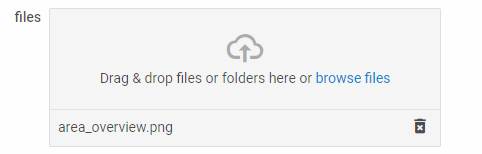

---
sidebar_label: SimpleVault
title: SimpleVault
---          

A handy control for quick and easy uploading of a file or a set of files.

{{editor    https://snippet.dhtmlx.com/ikyyekxq	Form. All DhxForm Inputs}}

{{editor	https://snippet.dhtmlx.com/ofy4k51o	Form. Simple Vault}}

Adding SimpleVault 
------------

You can easily add a SimpleVault control during initialization of a form:

~~~js
var form = new dhx.Form("form_container", {
	rows: [
    	{
			type: "simpleVault",
			name:"simplevault",
			label: "i am simpleVault",
			labelWidth: "120px",
			labelPosition: "left",
			disabled: false,
			required: false
		}
    ]
});
~~~

###Attributes

You can provide the following attributes in the configuration object of a SimpleVault:

<table class="webixdoc_links">
	<tbody>
    <tr>
			<td class="webixdoc_links0"><b>type</b></td>
			<td>(<i>string</i>) the type of a control, set it to "simpleVault"</td>
		</tr>
    <tr>
			<td class="webixdoc_links0"><b>name</b></td>
			<td>(<i>string</i>) the name of a control</td>
		</tr>
    <tr>
			<td class="webixdoc_links0"><b>id</b></td>
			<td>(<i>string</i>) the id of a control, auto-generated if not set</td>
		</tr>
    <tr>
			<td class="webixdoc_links0"><b>value</b></td>
			<td>(<i>array</i>) sets the default list of loaded files. Each file object can contain the following properties:
        <ul>
            <li><b>id</b> - (<i>string</i>) mandatory, the id of the file</li>
            <li><b>status</b> - (<i>string</i>) optional, the status of the file ("queue", "inprogress", "uploaded", or "failed") </li>
            <li><b>progress</b> - (<i>number</i>) optional, the progress of the file upload</li>
            <li><b>link</b> - (<i>string</i>) optional, the path to the uploaded file on a server. In order to download files from SimpleVault to the computer, file objects must have the link attribute specified with the path to their location on the server.</li>
            <li><b>request</b> - (<i>object</i>) optional, an XMLHttpRequest object sent to server when an upload begins</li>
            <li><b>path</b> - (<i>string</i>) optional, the path to the file on the computer starting from the name of the folder (in case a folder with files is added)</li>
            <li><b>name</b> - (<i>string</i>) optional, the name of the file including the extension (for adding files from a server)</li>
            <li><b>size</b> - (<i>number</i>) optional, the size of the file in bytes (for adding files from a server)</li>
        </ul>
      </td>
		</tr>
    <tr>
			<td class="webixdoc_links0"><b>width</b></td>
			<td>(<i>string|number|"content"</i>) the width of a control</td>
		</tr>
    <tr>
			<td class="webixdoc_links0"><b>height</b></td>
			<td>(<i>string|number|"content"</i>) the height of a control</td>
		</tr>
         <tr>
			<td class="webixdoc_links0"><b>padding</b></td>
			<td>(<i>string|number</i>) sets padding between a cell and a border of the SimpleVault control</td>
		</tr>	
    <tr>
			<td class="webixdoc_links0"><b>css</b></td>
			<td>(<i>string</i>) adds style classes to a control</td>
		</tr>
    <tr>
			<td class="webixdoc_links0"><b>disabled</b></td>
			<td>(<i>boolean</i>) defines whether a control is enabled (<i>false</i>) or disabled (<i>true</i>)</td>
		</tr>
    <tr>
			<td class="webixdoc_links0"><b>required</b></td>
			<td>(<i>boolean</i>) <a href="https://docs.dhtmlx.com/suite/form__work_with_form.html#validatingform">defines whether a control is required</a></td>
		</tr>
    <tr>
			<td class="webixdoc_links0"><b>hidden</b></td>
			<td>(<i>boolean</i>) defines whether a control is hidden</td>
		</tr>
    <tr>
			<td class="webixdoc_links0"><b>label</b></td>
			<td>(<i>string</i>) specifies a label for a control</td>
		</tr>
    <tr>
			<td class="webixdoc_links0"><b>labelWidth</b></td>
			<td>(<i>string|number</i>) sets the width of the label of a control</td>
		</tr>
    <tr>
			<td class="webixdoc_links0"><b>hiddenLabel</b></td>
			<td>(<i>boolean</i>) invisible label that will be used to identify the input on the server side</td>
		</tr>
    <tr>
			<td class="webixdoc_links0"><b>labelPosition</b></td>
			<td>(<i>string</i>) defines the position of a label: "left"|"top"</td>
		</tr>
    <tr>
			<td class="webixdoc_links0"><b>helpMessage</b></td>
			<td>(<i>string</i>) adds a help message to a control</td>
		</tr>
    <tr>
			<td class="webixdoc_links0"><b>preMessage</b></td>
			<td>(<i>string</i>) a message that contains instructions for interacting with the control</td>
		</tr>
    <tr>
			<td class="webixdoc_links0"><b>successMessage</b></td>
			<td>(<i>string</i>) a message that appears in case of successful validation of the control value</td>
		</tr>
    <tr>
			<td class="webixdoc_links0"><b>errorMessage</b></td>
			<td>(<i>string</i>) a message that appears in case of error during validation of the control value</td>
		</tr>
    <tr>
			<td class="webixdoc_links0"><b>fieldName</b></td>
			<td>(<i>string</i>) optional, sets the name of the file field in the form data that is sent to the server. By default takes its value from the value of the <b>name</b> property, or, if not specified, from the <b>id</b> attribute. </td>
		</tr>
    <tr>
			<td class="webixdoc_links0"><b>params</b></td>
			<td>(<i>object</i>) optional, adds extra parameters for sending an XMLHttpRequest</td>
		</tr>
    <tr>
			<td class="webixdoc_links0"><b>singleRequest</b></td>
			<td>(<i>boolean</i>) defines whether files are sent in one request, <i>false</i> by default</td>
		</tr>
    <tr>
			<td class="webixdoc_links0"><b>target</b></td>
			<td>(<i>string</i>) mandatory, sets an URL to the server-side script that will process file upload</td>
		</tr>
  </tbody>
</table>

Working with SimpleVault
----------------------

You can manipulate a SimpleVault control by using methods ([events](#eventhandling)) of the object returned by the [getItem()](form/api/form_getitem_method.md) method.

For example, you can get the value of the control:

~~~js
var value = form.getItem("simpleVault").getValue();
~~~

###List of the control methods:

{{api
- form/api/simplevault/simplevault_clear_method.md - clears a value of a SimpleVault control
- form/api/simplevault/simplevault_clearvalidate_method.md - clears validation of a SimpleVault control
- form/api/simplevault/simplevault_disable_method.md - disables a SimpleVault control on a page
- form/api/simplevault/simplevault_enable_method.md - enables a disabled SimpleVault control
- form/api/simplevault/simplevault_getproperties_method.md - returns an object with the available configuration attributes of the control
- form/api/simplevault/simplevault_getvalue_method.md - returns the current value of a SimpleVault control
- form/api/simplevault/simplevault_hide_method.md - hides a SimpleVault control
- form/api/simplevault/simplevault_isdisabled_method.md - checks whether a SimpleVault control is disabled
- form/api/simplevault/simplevault_isvisible_method.md - checks whether a SimpleVault control is visible on the page
- form/api/simplevault/simplevault_selectfile_method.md - opens the dialog for selecting a new file (files) for adding to a SimpleVault
- form/api/simplevault/simplevault_send_method.md - sends a POST request for file upload to a server-side URL
- form/api/simplevault/simplevault_setproperties_method.md - allows changing available configuration attributes of the control dynamically
- form/api/simplevault/simplevault_setvalue_method.md - sets the value for a SimpleVault control
- form/api/simplevault/simplevault_show_method.md - shows a SimpleVault control on the page
- form/api/simplevault/simplevault_validate_method.md - validates a SimpleVault control
}}

<h3 id="eventhandling">List of the control events:</h3>

{{api
- form/api/simplevault/simplevault_afterchangeproperties_event.md - fires after configuration attributes of the control have been changed dynamically
- form/api/simplevault/simplevault_afterhide_event.md - fires after a control is hidden
- form/api/simplevault/simplevault_aftershow_event.md - fires after a control is shown
- form/api/simplevault/simplevault_aftervalidate_event.md - fires after the control value is validated
- form/api/simplevault/simplevault_beforechangeproperties_event.md - fires before configuration attributes of the control are changed dynamically
- form/api/simplevault/simplevault_beforehide_event.md - fires before a control is hidden
- form/api/simplevault/simplevault_beforeshow_event.md - fires before a control is shown
- form/api/simplevault/simplevault_beforeuploadfile_event.md - fires before file upload begins
- form/api/simplevault/simplevault_beforevalidate_event.md - fires before the control value is validated
- form/api/simplevault/simplevault_change_event.md - fires on changing the value of a control
- form/api/simplevault/simplevault_uploadbegin_event.md - fires when file upload begins
- form/api/simplevault/simplevault_uploadcomplete_event.md - fires when upload is completed
- form/api/simplevault/simplevault_uploadfail_event.md - fires if the file upload failed
- form/api/simplevault/simplevault_uploadfile_event.md - fires when a file has been uploaded
- form/api/simplevault/simplevault_uploadprogress_event.md - fires on each percent of files uploading
}}

Using DataCollection API
--------------------------

You can manipulate a SimpleVault control with the help of the [DataCollection API](https://docs.dhtmlx.com/vault/api__refs__data_methods.html).

For example, you can remove one or all files from the list. To do that, you need to apply the [remove](https://docs.dhtmlx.com/vault/api__data__remove.html), or [removeAll](https://docs.dhtmlx.com/vault/api__data__removeall.html) method of DataCollection to the object returned by the [getItem()](form/api/form_getitem_method.md) method as follows:

~~~js
form.getItem("simpleVault").data.remove("file_id");

form.getItem("simpleVault").data.removeAll();
~~~

{{note Check the full list of [Data Collection API](https://docs.dhtmlx.com/vault/api__refs__data_methods.html).}}

Uploading files
------------------

You can read about uploading files into a SimpleVault control in the [related article](https://docs.dhtmlx.com/vault/uploading_files.html). 

@index:
- form/api/refs/simplevault_methods.md
- form/api/refs/simplevault_events.md