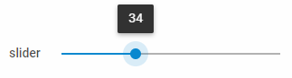

---
sidebar_label: Slider
title: Slider
---          

A control that allows selecting a numeric value by moving a thumb along a line with a fixed set of options.

https://snippet.dhtmlx.com/ikyyekxq	Form. All DhxForm Inputs

Adding Slider
------------

You can easily add a Slider control during initialization of a form:

~~~js
var form = new dhx.Form("form_container", {
    rows: [
		{
			type: "slider",
            name:"slider",
            label: "slider",
            labelWidth: "50px",
            min: 0,
            max: 100
		}
    ]
});
~~~

###Attributes

You can provide the following attributes in the configuration object of a Slider:

<table class="webixdoc_links">
	<tbody>
    <tr>
			<td class="webixdoc_links0"><b>type</b></td>
			<td>(<i>string</i>) the type of a control, set it to "slider"</td>
		</tr>
    <tr>
			<td class="webixdoc_links0"><b>name</b></td>
			<td>(<i>string</i>) the name of a control</td>
		</tr>
    <tr>
			<td class="webixdoc_links0"><b>id</b></td>
			<td>(<i>string</i>) the id of a control, auto-generated if not set</td>
		</tr>
    <tr>
			<td class="webixdoc_links0"><b>value</b></td>
			<td>(<i>number|number[]</i>) the value (or values, if the <b>range</b> option is set to <i>true</i>) the thumb will be set at on initialization of the slider</td>
		</tr>
    <tr>
			<td class="webixdoc_links0"><b>width</b></td>
			<td>(<i>string|number|"content"</i>) the width of a control</td>
		</tr>
    <tr>
			<td class="webixdoc_links0"><b>height</b></td>
			<td>(<i>string|number|"content"</i>) the height of a control</td>
		</tr>
         <tr>
			<td class="webixdoc_links0"><b>padding</b></td>
			<td>(<i>string|number</i>) sets padding between a cell and a border of the Slider control</td>
		</tr>	
    <tr>
			<td class="webixdoc_links0"><b>css</b></td>
			<td>(<i>string</i>) adds style classes to a control</td>
		</tr>
    <tr>
			<td class="webixdoc_links0"><b>disabled</b></td>
			<td>(<i>boolean</i>) defines whether a control is enabled (<i>false</i>) or disabled (<i>true</i>)</td>
		</tr>
    <tr>
			<td class="webixdoc_links0"><b>hidden</b></td>
			<td>(<i>boolean</i>) defines whether a control is hidden</td>
		</tr>
    <tr>
			<td class="webixdoc_links0"><b>label</b></td>
			<td>(<i>string</i>) specifies a label for a control</td>
		</tr>
    <tr>
			<td class="webixdoc_links0"><b>labelWidth</b></td>
			<td>(<i>string|number</i>) sets the width of the label of a control</td>
		</tr>
    <tr>
			<td class="webixdoc_links0"><b>hiddenLabel</b></td>
			<td>(<i>boolean</i>) invisible label that will be used to identify the input on the server side</td>
		</tr>
    <tr>
			<td class="webixdoc_links0"><b>labelPosition</b></td>
			<td>(<i>string</i>) defines the position of a label: "left"|"top"</td>
		</tr>
    <tr>
			<td class="webixdoc_links0"><b>helpMessage</b></td>
			<td>(<i>string</i>) adds a help message to a control</td>
		</tr>
    <tr>
			<td class="webixdoc_links0"><b>min</b></td>
			<td>(<i>number</i>) the minimal value of slider, 0 by default</td>
		</tr>
    <tr>
			<td class="webixdoc_links0"><b>max</b></td>
			<td>(<i>number</i>) the maximal value of slider, 100 by default</td>
		</tr>
    <tr>
			<td class="webixdoc_links0"><b>step</b></td>
			<td>(<i>number</i>) the step the slider thumb will be moved with, 1 by default</td>
		</tr>
    <tr>
			<td class="webixdoc_links0"><b>mode</b></td>
			<td>(<i>string</i>) the direction of the Slider scale, "horizontal" by default</td>
		</tr>
    <tr>
			<td class="webixdoc_links0"><b>tooltip</b></td>
			<td>(<i>boolean</i>) enables prompt messages with ticks values on hovering over the slider thumb, true by default</td>
		</tr>
    <tr>
			<td class="webixdoc_links0"><b>range</b></td>
			<td>(<i>boolean</i>) enables/disables the possibility to select a range of values on the slider</td>
		</tr>
    <tr>
			<td class="webixdoc_links0"><b>inverse</b></td>
			<td>(<i>boolean</i>) enables/disables the inverse slider mode</td>
		</tr>
    <tr>
			<td class="webixdoc_links0"><b>tick</b></td>
			<td>(<i>number</i>) sets the interval of steps for rendering the slider scale</td>
		</tr>
    <tr>
			<td class="webixdoc_links0"><b>majorTick</b></td>
			<td>(<i>number</i>) sets interval of rendering numeric values on the slider scale</td>
		</tr>
    <tr>
			<td class="webixdoc_links0"><b>tickTemplate</b></td>
			<td>(<i>function</i>) sets a template for rendering values on the scale</td>
		</tr>
  </tbody>
</table>

Working with Slider
----------------------

You can manipulate a Slider control by using methods (or [events](#eventhandling)) of the object returned by the [getItem()](/form/api/form_getitem_method) method.

For example, you can get the value of the control:

~~~js
var value = form.getItem("slider_id").getValue();
~~~

###List of the control methods:

{{api
- form/api/slider/slider_clear_method.md - clears a value of a Slider control
- form/api/slider/slider_disable_method.md - disables a Slider control on a page
- form/api/slider/slider_enable_method.md - enables a disabled Slider control
- form/api/slider/slider_getproperties_method.md - returns an object with the available configuration attributes of the control
- form/api/slider/slider_getvalue_method.md - returns the current value of a Slider control
- form/api/slider/slider_getwidget_method.md - returns the dhtmlxSlider widget attached to a Slider control
- form/api/slider/slider_hide_method.md - hides a Slider control
- form/api/slider/slider_isdisabled_method.md - checks whether a Slider control is disabled
- form/api/slider/slider_isvisible_method.md - checks whether a Slider control is visible on the page
- form/api/slider/slider_setproperties_method.md - allows changing available configuration attributes of the control dynamically
- form/api/slider/slider_setvalue_method.md - sets the value for a Slider control
- form/api/slider/slider_show_method.md - shows a Slider control on the page
}}

<h3 id="eventhandling">List of the control events:</h3>

{{api
- form/api/slider/slider_afterchangeproperties_event.md - fires after configuration attributes of the control have been changed dynamically
- form/api/slider/slider_afterhide_event.md - fires after a control is hidden
- form/api/slider/slider_aftershow_event.md - fires after a control is shown
- form/api/slider/slider_beforechangeproperties_event.md - fires before configuration attributes of the control are changed dynamically
- form/api/slider/slider_beforehide_event.md - fires before a control is hidden
- form/api/slider/slider_beforeshow_event.md - fires before a control is shown
- form/api/slider/slider_change_event.md - fires on changing the value of a control
}}

### Working with the dhtmlxSlider widget

There is a possibility to use methods of dhtmlxSlider via the <strong>getWidget()</strong> method of a Slider control.

For example, you can disable a Slider control. To do this, you need to get the widget attached to the Slider control and then use the [disable()](/slider/api/slider_disable_method) method of this widget.

~~~js
var slider = form.getItem("slider_id").getWidget();  // -> dhtmlxSlider
slider.disable(); // disables slider
~~~

- form/api/refs/slider_methods.md
- form/api/refs/slider_events.md