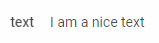

---
sidebar_label: Text
title: Text
---          

```todo

A control for adding some text.



{{editor    https://snippet.dhtmlx.com/ikyyekxq	Form. All DhxForm Inputs}}

Adding Text
------------

You can easily add a Text control during initialization of a form:

~~~js
var form = new dhx.Form("form_container", {
    rows: [
		{
			type: "text",
            name: "text",
            label: "text",						
			value: "I am a nice text"
		}
    ]
});
~~~


###Attributes

You can provide the following attributes in the configuration object of a Text:

<table class="webixdoc_links">
	<tbody>
        <tr>
			<td class="webixdoc_links0"><b>type</b></td>
			<td>(<i>string</i>) the type of a control, set it to "text"</td>
		</tr>
		 <tr>
			<td class="webixdoc_links0"><b>inputType</b></td>
			<td>(<i>string</i>) sets the type of an input: "text", "password", "number". <br/>Using the "number" type for the input sets the type of the <b>value</b> attribute to "number". <br/>Use the "password" value to specify a field for entering a password.</td>
		</tr>
		<tr>
			<td class="webixdoc_links0"><b>name</b></td>
			<td>(<i>string</i>) the name of a control</td>
		</tr>
		<tr>
			<td class="webixdoc_links0"><b>id</b></td>
			<td>(<i>string</i>) the id of a control, auto-generated if not set</td>
		</tr>
		<tr>
			<td class="webixdoc_links0"><b>value</b></td>
			<td>(<i>string|number</i>) the value of a text control</td>
		</tr>
		<tr>
			<td class="webixdoc_links0"><b>width</b></td>
			<td>(<i>string|number|"content"</i>) the width of a control</td>
		</tr>
		<tr>
			<td class="webixdoc_links0"><b>height</b></td>
			<td>(<i>string|number|"content"</i>) the height of a control</td>
		</tr>
         <tr>
			<td class="webixdoc_links0"><b>padding</b></td>
			<td>(<i>string|number</i>) sets padding between a cell and a border of the Text control</td>
		</tr>	
		<tr>
			<td class="webixdoc_links0"><b>css</b></td>
			<td>(<i>string</i>) adds style classes to a control</td>
		</tr>
		<tr>
			<td class="webixdoc_links0"><b>disabled</b></td>
			<td>(<i>boolean</i>) defines whether a control is enabled (<i>false</i>) or disabled (<i>true</i>)</td>
		</tr>
		<tr>
			<td class="webixdoc_links0"><b>hidden</b></td>
			<td>(<i>boolean</i>) defines whether a control is hidden</td>
		</tr>
		<tr>
			<td class="webixdoc_links0"><b>label</b></td>
			<td>(<i>string</i>) specifies a label for a control</td>
		</tr>
		<tr>
			<td class="webixdoc_links0"><b>labelWidth</b></td>
			<td>(<i>string|number</i>) sets the width of the label of a control</td>
		</tr>
		<tr>
			<td class="webixdoc_links0"><b>hiddenLabel</b></td>
			<td>(<i>boolean</i>) invisible label that will be used to identify the input on the server side</td>
		</tr>
		<tr>
			<td class="webixdoc_links0"><b>labelPosition</b></td>
			<td>(<i>string</i>) defines the position of a label: "left"|"top"</td>
		</tr>
		<tr>
			<td class="webixdoc_links0"><b>helpMessage</b></td>
			<td>(<i>string</i>) adds a help message to a control</td>
		</tr>
		<tr>
			<td class="webixdoc_links0"><b>preMessage</b></td>
			<td>(<i>string</i>) a message that contains instructions for interacting with the control</td>
		</tr>
		<tr>
			<td class="webixdoc_links0"><b>successMessage</b></td>
			<td>(<i>string</i>) a message that appears in case of successful validation of the control value</td>
		</tr>
		<tr>
			<td class="webixdoc_links0"><b>errorMessage</b></td>
			<td>(<i>string</i>) a message that appears in case of error during validation of the control value</td>
		</tr>
    </tbody>
</table>


Working with Text
----------------------

You can manipulate a Text control by using methods (or [events](#eventhandling)) of the object returned by the [getItem()](form/api/form_getitem_method.md) method.

For example, you can get the value of the control:

~~~js
var value = form.getItem("text").getValue();
~~~

###List of the control methods:

{{api
- form/api/text/text_clear_method.md - clears a value of a Text control
- form/api/text/text_disable_method.md - disables a Text control on a page
- form/api/text/text_enable_method.md - enables a disabled Text control
- form/api/text/text_getproperties_method.md - returns an object with the available configuration attributes of the control
- form/api/text/text_getvalue_method.md - returns the current value of a Text control
- form/api/text/text_hide_method.md - hides a Text control
- form/api/text/text_isdisabled_method.md - checks whether a Text control is disabled
- form/api/text/text_isvisible_method.md - checks whether a Text control is visible on the page
- form/api/text/text_setproperties_method.md - allows changing available configuration attributes of the control dynamically
- form/api/text/text_setvalue_method.md - sets the value for a Text control
- form/api/text/text_show_method.md - shows a Text control on the page
}}


<h3 id="eventhandling">List of the control events:</h3>

{{api
- form/api/text/text_afterchangeproperties_event.md - fires after configuration attributes of the control have been changed dynamically
- form/api/text/text_afterhide_event.md - fires after a control is hidden
- form/api/text/text_aftershow_event.md - fires after a control is shown
- form/api/text/text_aftervalidate_event.md - fires after the control value is validated
- form/api/text/text_beforechangeproperties_event.md - fires before configuration attributes of the control are changed dynamically
- form/api/text/text_beforehide_event.md - fires before a control is hidden
- form/api/text/text_beforeshow_event.md - fires before a control is shown
- form/api/text/text_beforevalidate_event.md - fires before the control value is validated
- form/api/text/text_change_event.md - fires on changing the value of a control
}}

@index:
- form/api/refs/text_methods.md
- form/api/refs/text_events.md

``` todo