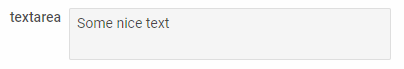

---
sidebar_label: Textarea
title: Textarea
---          

A control that allows a user to enter a simple multi-line text.

https://snippet.dhtmlx.com/ikyyekxq	Form. All DhxForm Inputs

https://snippet.dhtmlx.com/mt93jzrk	Form. Textareas

Adding Textarea
------------

You can easily add a Textarea control during initialization of a form:

~~~js
var form = new dhx.Form("form_container", {
    rows: [
		{
			type: "textarea",
            name:"textarea",
            label: "textarea",
            labelWidth: "70px",
            value: "Some nice text",
            width:400
		}
    ]
});
~~~

###Attributes

You can provide the following attributes in the configuration object of a Textarea:

<table class="webixdoc_links">
	<tbody>
    <tr>
			<td class="webixdoc_links0"><b>type</b></td>
			<td>(<i>string</i>) the type of a control, set it to "textarea"</td>
		</tr>
    <tr>
			<td class="webixdoc_links0"><b>name</b></td>
			<td>(<i>string</i>) the name of a control</td>
		</tr>
    <tr>
			<td class="webixdoc_links0"><b>id</b></td>
			<td>(<i>string</i>) the id of a control, auto-generated if not set</td>
		</tr>
    <tr>
			<td class="webixdoc_links0"><b>value</b></td>
			<td>(<i>string</i>) the initial value of the textarea</td>
		</tr>
    <tr>
			<td class="webixdoc_links0"><b>validation</b></td>
			<td>(<i>string,function</i>) <a href="https://docs.dhtmlx.com/suite/form__work_with_form.html#validatingform">the rule of input validation</a>. Can be set in two ways:
        <ul><li>as a predefined string value:
        <ol>- "email" - validEmail</ol>
        <ol>- "integer" - validInteger</ol>
        <ol>- "numeric" - validNumeric</ol>
        <ol>- "alphanumeric" - validAplhaNumeric</ol>
        <ol>- "IPv4" - validIPv4</ol>
        </li>
        <li>as a <i>function</i> that defines a custom validation rule. It takes as a parameter the value typed in the input and returns <i>true</i>, if the entered value is valid.</li></ul>
	    </td>
		</tr>
    <tr>
			<td class="webixdoc_links0"><b>placeholder</b></td>
			<td>(<i>string</i>) a tip for the textarea</td>
		</tr>
    <tr>
			<td class="webixdoc_links0"><b>readOnly</b></td>
			<td>(<i>boolean</i>) defines whether a textarea is readonly</td>
		</tr>
    <tr>
			<td class="webixdoc_links0"><b>resizable</b></td>
			<td>(<i>boolean</i>) adds a resizer icon into a textarea, if set to <i>true</i></td>
		</tr>
    <tr>
			<td class="webixdoc_links0"><b>width</b></td>
			<td>(<i>string|number|"content"</i>) the width of a control</td>
		</tr>
    <tr>
			<td class="webixdoc_links0"><b>height</b></td>
			<td>(<i>string|number|"content"</i>) the height of a control</td>
		</tr>
         <tr>
			<td class="webixdoc_links0"><b>padding</b></td>
			<td>(<i>string|number</i>) sets padding between a cell and a border of the Textarea control</td>
		</tr>
		<tr>
			<td class="webixdoc_links0"><b>minlength</b></td>
			<td>(<i>string|number</i>) the minimum <a href="https://docs.dhtmlx.com/suite/form__work_with_form.html#validatingform">number of characters allowed in the textarea</a></td>
		</tr>
		<tr>
			<td class="webixdoc_links0"><b>maxlength</b></td>
			<td>(<i>string|number</i>) the maximum <a href="https://docs.dhtmlx.com/suite/form__work_with_form.html#validatingform">number of characters allowed in the textarea</a></td>
		</tr>	
    <tr>
			<td class="webixdoc_links0"><b>css</b></td>
			<td>(<i>string</i>) adds style classes to a control</td>
		</tr>
    <tr>
			<td class="webixdoc_links0"><b>disabled</b></td>
			<td>(<i>boolean</i>) defines whether a control is enabled (<i>false</i>) or disabled (<i>true</i>)</td>
		</tr>
    <tr>
			<td class="webixdoc_links0"><b>hidden</b></td>
			<td>(<i>boolean</i>) defines whether a control is hidden</td>
		</tr>
    <tr>
			<td class="webixdoc_links0"><b>label</b></td>
			<td>(<i>string</i>) specifies a label for a control</td>
		</tr>
    <tr>
			<td class="webixdoc_links0"><b>labelWidth</b></td>
			<td>(<i>string|number</i>) sets the width of the label of a control</td>
		</tr>
    <tr>
			<td class="webixdoc_links0"><b>hiddenLabel</b></td>
			<td>(<i>boolean</i>) invisible label that will be used to identify the input on the server side</td>
		</tr>
    <tr>
			<td class="webixdoc_links0"><b>labelPosition</b></td>
			<td>(<i>string</i>) defines the position of a label: "left"|"top"</td>
		</tr>
    <tr>
			<td class="webixdoc_links0"><b>required</b></td>
			<td>(<i>boolean</i>) <a href="https://docs.dhtmlx.com/suite/form__work_with_form.html#validatingform">defines whether a control is required</a></td>
		</tr>
    <tr>
			<td class="webixdoc_links0"><b>helpMessage</b></td>
			<td>(<i>string</i>) adds a help message to a control</td>
		</tr>
    <tr>
			<td class="webixdoc_links0"><b>preMessage</b></td>
			<td>(<i>string</i>) a message that contains instructions for interacting with the control</td>
		</tr>
    <tr>
			<td class="webixdoc_links0"><b>successMessage</b></td>
			<td>(<i>string</i>) a message that appears in case of successful validation of the control value</td>
		</tr>
    <tr>
			<td class="webixdoc_links0"><b>errorMessage</b></td>
			<td>(<i>string</i>) a message that appears in case of error during validation of the control value	</td>
		</tr>
    </tbody>
</table>

Working with Textarea
----------------------

You can manipulate a Textarea control by using methods (or [events](#eventhandling)) of the object returned by the [getItem()](/form/api/form_getitem_method) method.

For example, you can get the value of the control:

~~~js
var value = form.getItem("textarea").getValue();
~~~

###List of the control methods:

{{api
- form/api/textarea/textarea_clear_method.md - clears a value of a Textarea control
- form/api/textarea/textarea_clearvalidate_method.md - clears validation of a Textarea control
- form/api/textarea/textarea_disable_method.md - disables a Textarea control on a page
- form/api/textarea/textarea_enable_method.md - enables a disabled Textarea control
- form/api/textarea/textarea_focus_method.md - sets focus to a control
- form/api/textarea/textarea_getproperties_method.md - returns an object with the available configuration attributes of the control
- form/api/textarea/textarea_getvalue_method.md - returns the current value of a Textarea control
- form/api/textarea/textarea_hide_method.md - hides a Textarea control
- form/api/textarea/textarea_isdisabled_method.md - checks whether a Textarea control is disabled
- form/api/textarea/textarea_isvisible_method.md - checks whether a Textarea control is visible on the page
- form/api/textarea/textarea_setproperties_method.md - allows changing available configuration attributes of the control dynamically
- form/api/textarea/textarea_setvalue_method.md - sets the value for a Textarea control
- form/api/textarea/textarea_show_method.md - shows a Textarea control on the page
- form/api/textarea/textarea_validate_method.md - validates a Textarea control
}}

<h3 id="eventhandling">List of the control events:</h3>

{{api
- form/api/textarea/textarea_afterchangeproperties_event.md - fires after configuration attributes of the control have been changed dynamically
- form/api/textarea/textarea_afterhide_event.md - fires after a control is hidden
- form/api/textarea/textarea_aftershow_event.md - fires after a control is shown
- form/api/textarea/textarea_aftervalidate_event.md - fires after the control value is validated
- form/api/textarea/textarea_beforechangeproperties_event.md - fires before configuration attributes of the control are changed dynamically
- form/api/textarea/textarea_beforehide_event.md - fires before a control is hidden
- form/api/textarea/textarea_beforeshow_event.md - fires before a control is shown
- form/api/textarea/textarea_beforevalidate_event.md - fires before the control value is validated
- form/api/textarea/textarea_change_event.md - fires on changing the value of a control
- form/api/textarea/textarea_input_event.md - fires when a user types some text in the textarea
}}

- form/api/refs/textarea_methods.md
- form/api/refs/textarea_events.md