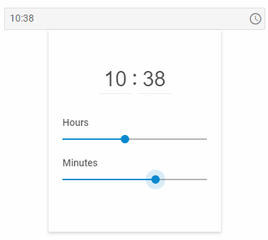

---
sidebar_label: TimePicker
title: TimePicker
---          

``` todo

A control that allows a user to select time value either by moving handles along track bars or by entering hour and minutes values directly into related inputs.



https://snippet.dhtmlx.com/ikyyekxq	Form. All DhxForm Inputs

https://snippet.dhtmlx.com/4k3o8p7b	Form. TimePicker

Adding TimePicker 
------------

You can easily add a TimePicker control during initialization of a form:

~~~js
var form = new dhx.Form("form_container", {
	rows: [
    	{
			type: "timepicker",
            name: "timepicker",
            label: "time",
            labelWidth: "50px",
			timeFormat: 12,
    		valueFormat: "timeObject",
            value: [6,20,"AM"]
		}
    ]
});
~~~

###Attributes

You can provide the following attributes in the configuration object of a TimePicker:

<table class="webixdoc_links">
	<tbody>
    <tr>
			<td class="webixdoc_links0"><b>type</b></td>
			<td>(<i>string</i>) the type of a control, set it to "timepicker"</td>
		</tr>
    <tr>
			<td class="webixdoc_links0"><b>id</b></td>
			<td>(<i>string</i>) the id of a control, auto-generated if not set</td>
		</tr>
    <tr>
			<td class="webixdoc_links0"><b>value</b></td>
			<td>(<i>Date|number|string|array|object</i>) the initial value of the TimePicker control: <br/>1. The value of a timepicker set as an array should have the following elements: 
			<ul>
				<li>the hour value</li>
				<li>the minutes value</li>
				<li>the "AM/PM" identifier for 12-hour format as a string</li>
			</ul>
			2. The value set as an object:
            <ul><li>for the 24-hour format contains <i>key:value</i> pairs for hours, minutes and their values: {hour: 0, minute: 39}</li> 
            <li>for the 12-hour format contains <i>key:value</i> pairs for for hours, minutes, am/pm identifiers and their values: {hour: 6, minute: 0, AM: true}</li></ul>
			3. The date set as a number is the number of milliseconds since January 1, 1970, 00:00:00 UTC returned by the <a href="https://developer.mozilla.org/en-US/docs/Web/JavaScript/Reference/Global_Objects/Date/getTime">getTime()</a> method of the <b>Date</b> object.<br/></td>
		</tr>
		<tr>
			<td class="webixdoc_links0"><b>valueFormat</b></td>
			<td>(<i>string</i>) defines the format of the value to be applied when working with the events of the timepicker control: "string", "timeObject"</td>
		</tr>
    <tr>
			<td class="webixdoc_links0"><b>validation</b></td>
			<td>(<i>function</i>) <a href="https://docs.dhtmlx.com/suite/form__work_with_form.html#validatingform">the validation function</a>, takes as a parameter the value to validate and returns <i>true/false</i> to indicate the result of validation</td>
		</tr>
    <tr>
			<td class="webixdoc_links0"><b>icon</b></td>
			<td>(<i>string</i>) the name of an <a href="https://docs.dhtmlx.com/suite/helpers__icon.html">icon</a> from the used icon font</td>
		</tr>
    <tr>
			<td class="webixdoc_links0"><b>placeholder</b></td>
			<td>(<i>string</i>) a tip for the input</td>
		</tr>
    <tr>
			<td class="webixdoc_links0"><b>editable</b></td>
			<td>(<i>boolean</i>) allows a user to enter the value of the control manually</td>
		</tr>
    <tr>
			<td class="webixdoc_links0"><b>width</b></td>
			<td>(<i>string|number|"content"</i>) the width of a control</td>
		</tr>
    <tr>
			<td class="webixdoc_links0"><b>height</b></td>
			<td>(<i>string|number|"content"</i>) the height of a control</td>
		</tr>
         <tr>
			<td class="webixdoc_links0"><b>padding</b></td>
			<td>(<i>string|number</i>) sets padding between a cell and a border of the TimePicker control</td>
		</tr>	
    <tr>
			<td class="webixdoc_links0"><b>css</b></td>
			<td>(<i>string</i>) adds style classes to a control</td>
		</tr>
    <tr>
			<td class="webixdoc_links0"><b>disabled</b></td>
			<td>(<i>boolean</i>) defines whether a control is enabled (<i>false</i>) or disabled (<i>true</i>)</td>
		</tr>
    <tr>
			<td class="webixdoc_links0"><b>hidden</b></td>
			<td>(<i>boolean</i>) defines whether a control is hidden</td>
		</tr>
    <tr>
			<td class="webixdoc_links0"><b>label</b></td>
			<td>(<i>string</i>) specifies a label for a control</td>
		</tr>
    <tr>
			<td class="webixdoc_links0"><b>labelWidth</b></td>
			<td>(<i>string|number</i>) sets the width of the label of a control</td>
		</tr>
    <tr>
			<td class="webixdoc_links0"><b>hiddenLabel</b></td>
			<td>(<i>boolean</i>) invisible label that will be used to identify the input on the server side</td>
		</tr>
    <tr>
			<td class="webixdoc_links0"><b>labelPosition</b></td>
			<td>(<i>string</i>) defines the position of a label: "left"|"top"</td>
		</tr>
    <tr>
			<td class="webixdoc_links0"><b>name</b></td>
			<td>(<i>string</i>) the name of a control</td>
		</tr>
    <tr>
			<td class="webixdoc_links0"><b>required</b></td>
			<td>(<i>boolean</i>) <a href="https://docs.dhtmlx.com/suite/form__work_with_form.html#validatingform">defines whether a control is required</a></td>
		</tr>
    <tr>
			<td class="webixdoc_links0"><b>helpMessage</b></td>
			<td>(<i>string</i>) adds a help message to a control</td>
		</tr>
    <tr>
			<td class="webixdoc_links0"><b>preMessage</b></td>
			<td>(<i>string</i>) a message that contains instructions for interacting with the control</td>
		</tr>
    <tr>
			<td class="webixdoc_links0"><b>successMessage</b></td>
			<td>(<i>string</i>) a message that appears in case of successful validation of the control value</td>
		</tr>
    <tr>
			<td class="webixdoc_links0"><b>errorMessage</b></td>
			<td>(<i>string</i>) a message that appears in case of error during validation of the control value</td>
		</tr>
    <tr>
			<td class="webixdoc_links0"><b>timeFormat</b></td>
			<td>(<i>number</i>) defines what clock format is activated: the 12-hour or 24-hour one. Set the property to 12 or 24 (default) value, correspondingly</td>
		</tr>
    <tr>
			<td class="webixdoc_links0"><b>controls</b></td>
			<td>(<i>boolean</i>) defines whether a timepicker is equipped with the Close and Save buttons</td>
		</tr>
    </tbody>
</table>

Working with TimePicker
----------------------

You can manipulate a TimePicker control by using methods (or [events](#eventhandling)) of the object returned by the [getItem()](/form/api/form_getitem_method) method.

For example, you can get the value of the control:

~~~js
var value = form.getItem("timepicker").getValue();
~~~

###List of the control methods:

{{api
- form/api/timepicker/timepicker_clear_method.md - clears the value of a TimePicker control
- form/api/timepicker/timepicker_clearvalidate_method.md - clears validation of a TimePicker control
- form/api/timepicker/timepicker_disable_method.md - disables a TimePicker control on a page
- form/api/timepicker/timepicker_enable_method.md - enables a disabled TimePicker control
- form/api/timepicker/timepicker_focus_method.md - sets focus to a control
- form/api/timepicker/timepicker_getproperties_method.md - returns an object with the available configuration attributes of the control
- form/api/timepicker/timepicker_getvalue_method.md - returns the current value of a TimePicker control
- form/api/timepicker/timepicker_getwidget_method.md - returns the dhtmlxTimePicker widget attached to a TimePicker control
- form/api/timepicker/timepicker_hide_method.md - hides a TimePicker control
- form/api/timepicker/timepicker_isdisabled_method.md - checks whether a TimePicker control is disabled
- form/api/timepicker/timepicker_isvisible_method.md - checks whether a TimePicker control is visible on the page
- form/api/timepicker/timepicker_setproperties_method.md - allows changing available configuration attributes of the control dynamically
- form/api/timepicker/timepicker_setvalue_method.md - sets the value for a TimePicker control
- form/api/timepicker/timepicker_show_method.md - shows a TimePicker control on the page
- form/api/timepicker/timepicker_validate_method.md - validates a TimePicker control
}}

<h3 id="eventhandling">List of the control events:</h3>

{{api
- form/api/timepicker/timepicker_afterchangeproperties_event.md - fires after configuration attributes of the control have been changed dynamically
- form/api/timepicker/timepicker_afterhide_event.md - fires after a control is hidden
- form/api/timepicker/timepicker_aftershow_event.md - fires after a control is shown
- form/api/timepicker/timepicker_aftervalidate_event.md - fires after the control value is validated
- form/api/timepicker/timepicker_beforechangeproperties_event.md - fires before configuration attributes of the control are changed dynamically
- form/api/timepicker/timepicker_beforehide_event.md - fires before a control is hidden
- form/api/timepicker/timepicker_beforeshow_event.md - fires before a control is shown
- form/api/timepicker/timepicker_beforevalidate_event.md - fires before the control value is validated
- form/api/timepicker/timepicker_change_event.md - fires on changing the value of a control
- form/api/timepicker/timepicker_input_event.md - fires when a user enters the value of a control in the input manually

}}


### Working with the dhtmlxTimePicker widget

There is a possibility to use methods of dhtmlxTimePicker via the <strong>getWidget()</strong> method of a TimePicker control.

For example, you can set value for a TimePicker control. To do this, you need to get the widget attached to the TimePicker control and then use the [setValue()](/timepicker/api/timepicker_setvalue_method) method of this widget.

~~~js
var timepicker = form.getItem("timepicker").getWidget();  // -> TimePicker
timepicker.setValue("00:39"); //set the value as a string
~~~

https://snippet.dhtmlx.com/0aqkdsi7	Form. Get Widget Of Control


- form/api/refs/timepicker_methods.md
- form/api/refs/timepicker_events.md

``` todo