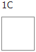

---
sidebar_label: Layout Patterns
title: Layout Patterns
---          

Layout patterns are predefined combinations of [rows and columns](layout/layout_structure.md) that provide you with various options of arranging cells inside of a layout in a neat structure.

dhtmlxLayout provides the following predefined patterns:

 
 
 

The patterns are named in accordance with their structure. Each scheme is similar to a Latin letter.

Click on the desired pattern to see its example in Snippet Tool. 