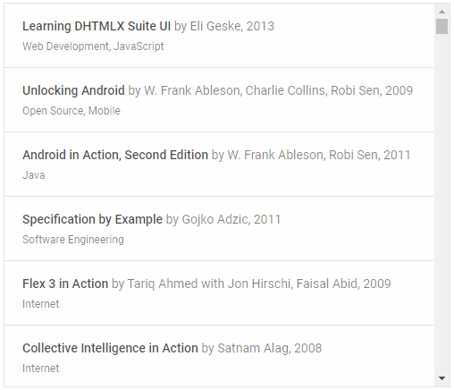

---
sidebar_label: List
title: List
---          

``` todo

dhtmlxList is a client-side JavaScript component that displays a collection of objects in a list according to a user-defined template.
It allows you to arrange multiple objects with similar properties within a single container and make your data organized. Check [online samples for dhtmlxList](https://docs.dhtmlx.com/suite/samples/list/). 



<div class="h2">API reference</div>

- list/api/refs/list.md

<div class="h2">Related resources</div>

- You can get dhtmlxList as a part of the Suite library by [downloading dhtmlxSuite](https://dhtmlx.com/docs/products/dhtmlxSuite/download.shtml)          
- There are also [online samples for dhtmlxList](https://docs.dhtmlx.com/suite/samples/list/)  

<div class="h2">Guides</div>
<table class='guide-table'>
	<tbody>
    <tr>
        <td id="import" class='topics'>
            <ul id="import_sublist">
            	<li>list/initialization.md</li>  	
                <li>list/configuration.md</li>
                <li>list/load_data.md</li>
                <li>list/work_with_list.md</li>
                <li>list/usage_selection.md</li>
                <li>list/customization.md</li>
                <li>list/events.md</li>
            </ul>
        </td>
        <td class='topic_description'>Describes the initialization of List and the main ways of working with the component and customizing it.</td>
    </tr> 
   	</tbody>
</table>

<div class="h2">Other</div>

<table class='other-table'>
	<tbody>
    <tr>
        <td id="other" class='topics'>            
            <ul id="other_sublist">
                <li>list/migration.md</li>

            </ul>
        </td>
    </tr>           
</tbody>

</table>

@index:
- list/api/refs/list.md
- list/initialization.md
- list/configuration.md
- list/load_data.md
- list/work_with_list.md
- list/usage_selection.md
- list/customization.md
- list/events.md
- list/migration.md


@metadescr:
dhtmlxList is a mobile-friendly JavaScript widget for rendering items in a list according to a user-defined template. Comprehensive and flexible API allows configuring your list easily  the way you need.


``` todo