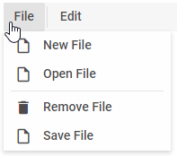
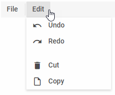
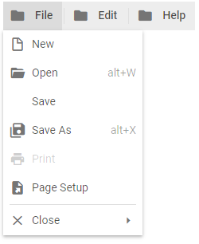

Menu Controls
===================

``` todo

In this article you'll find the controls you can use in dhtmlxMenu. Their descriptions contain lists of attributes and examples of adding the controls into Menu on the fly.

To operate Menu controls, you can use Menu API and [Tree Collection API](helpers/tree_collection.md). Check the related article.

MenuItem
-----------

MenuItem is a drop-down list of options.


### Adding menuItem

You can add a MenuItem control into the menu with the help of the **add()** method of Tree Collection:

~~~js
menu.data.add({
	type:"menuItem", value:"Menu", items:[
		{ type:"menuItem", value:"Option 1" },
		{ type:"menuItem", value:"Option 2" },
		{ type:"separator"},
		{ type:"menuItem", value:"Option Infinite" }
	]
});
~~~

#### Attributes


You can provide the following **attributes** in the configuration object of a MenuItem control:

- **type** - (*string*) required, the type of a control, set it to "menuItem"
- **id** - (*string*) the id of a control, auto-generated if not set
- **icon** - (*string*) optional, the name of an icon from the used icon font
- **items** - (*array*) optional, an array of children controls (note that all the children should have the type *menuItem*)
- **value** - (*string*)  optional, a value for the menu item
- **hotkey** - (*string*) optional, the name of a keyboard shortcut for a menu item

Separator
------------

This is a horizontal (between menu options) or vertical (between menu items) line separating items/groups of items from each other.




### Adding Separator

A new Separator can be created with the help of the **add()** method of Tree Collection:

~~~js
menu.data.add({
	type:"separator"
});
~~~


#### Attributes

Separator can have two attributes:

- **type** - (*string*) required, the item type, set it to "separator"
- **id** - (*string*) the ID of a control, automatically generated if you do not set it


Spacer
-----------

This item takes space on the toolbar and is used for aligning controls.




### Adding Spacer

A new Spacer can be created with the help of the **add()** method of Tree Collection:

~~~js
toolbar.data.add({
	type:"spacer"
});
~~~

#### Attributes

Spacer can have two attributes:

- **type** - (*string*) required, the type of a control, set it to "spacer"
- **id** - (*string*) the ID of a control, automatically generated if you do not set it


Work with Menu Options
--------------------


## Showing/Hiding Menu Options

<!-- You can hide and show menu items with the help of the [hide()]() / [show()]() methods: todo --> 

~~~js
menu.hide(id);
menu.show(id);
~~~

Both methods have one parameter - the ID of the menu item.

## Disabling/Enabling Menu Options

<!-- You can disable one menu option or several options at a time with the [disable()]() method todo: -->

~~~js
menu.disable("1");
menu.enable(["2","3"]);
~~~



You can enable one menu option or several options at a time:

~~~js
menu.enable("1");
menu.enable(["1","3"]);
~~~

Both methods take one parameter: the ID of the menu item or an array of IDs.

## Rearranging Menu Items

<!-- You can move menu items to different positions with the [move()](todo) method. For example, this is how you can move an item with ID "2" to the left edge of the menu: -->

~~~js
menu.data.move("2",0);
~~~

{{note
The ID should always be a string, even if in menu item configuration you set it as a number.
}}

<!-- To get the current position, use the [getIndex()](todo) method of TreeCollection: -->

~~~js
menu.data.getIndex("id");
~~~

{{note
Indexes are counted from 0.
}}

## Iterating through All Menu Items

<!-- You can work with all (or some) menu items with the help of the [map()](todo) method of TreeCollection: -->

~~~js
// remove all icons from the menu
menu.data.map((item)=>{
    item.icon = "";
});
menu.paint();
~~~

## Setting Item Text 

<!-- You can set text labels for any menu item. Access the needed item with the [getItem()](todo) method of the TreeCollection: -->

~~~js
myMenu.data.getItem("id").value = "Open";
myMenu.paint();
~~~

## Setting Item Hotkey

You can add a shortcut to a menu option. After you add a hotkey, a label with the keys will be added to the option.

~~~js
menu.data.getItem("id").hotkey = "Ctrl+N";
myMenu.paint();
~~~


## Removing Menu Items  

You can remove any item from a menu. The item will be removed with all its sub-items.

~~~js
myMenu.data.remove("id");
~~~

<!-- To remove all items from Menu, call the [removeAll()](todo) method. Afterwards, you can load other options. -->

~~~js
myMenu.data.removeAll();
menu.data.parse(new_options);
~~~

@todo:
add links to Menu API and article on work with menu<br>
add links to samples

``` todo