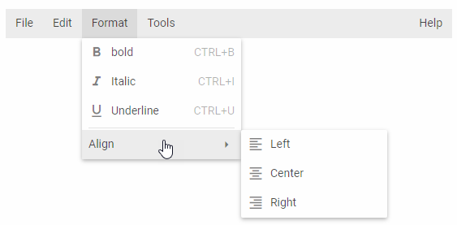

---
sidebar_label: Overview
title: Menu overview
---          

dhtmlxMenu is a component that provides an easy way to add a drop down menu to user's projects. This component is highly customizable and supports a wide range of features. dhtmlxMenu component can be a good navigation aid to web sites, help systems, etc. Check [online samples for dhtmlxMenu](https://docs.dhtmlx.com/suite/samples/menu/). 

## API reference

- menu/api/refs/menu.md

## Related resources

- You can get dhtmlxMenu as a part of the Suite library by [downloading dhtmlxSuite](https://dhtmlx.com/docs/products/dhtmlxSuite/download.shtml)          
- There are also [online samples for dhtmlxMenu](https://docs.dhtmlx.com/suite/samples/menu/)  

## Guides

You can read the following articles to find out how to add Menu on the page and work with it.

<table class='guide-table'>
    <tbody>
	<tr>
		<td id="data" class='topics'>		    
		    <ul id="data_sublist">                    
                <li>menu/how_to_start.md</li>
            	<li>menu/configuring_menu_items.md</li>                
                <li>menu/from_script.md</li>                        
           		<li>menu/work_with_menu.md</li>	
                <li>menu/creating_context_menu.md</li>
                <li>menu/fa_icons.md</li>                 
                <li>menu/handling_events.md</li>              
            </ul>
        </td>
        <td class='topic_description'>Covers common information you may need while working with Menu.</td>
    </tr>
    </tbody>
</table>

@index:

- menu/api/refs/menu.md
- menu/how_to_start.md
- menu/configuring_menu_items.md
- menu/from_script.md
- menu/work_with_menu.md
- menu/creating_context_menu.md
- menu/fa_icons.md
- menu/handling_events.md

    
@metadescr:
dhtmlxMenu is an easy configurable JavaScript component that provides handy navigation between items in a drop-down or context menu. 

