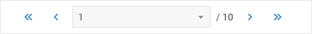
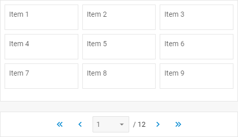

---
sidebar_label: Configuration
title: Configuration
---          

Input width
---------------

By default, the input of a pager takes the auto-width that fits its maximum content. You can change the input width and set any other value via the [inputWidth](pager/api/pager_inputwidth_config.md) property, for example:

~~~js
const pager = new dhx.Pager("pager_container", {
    css: "dhx_widget--bordered",
    inputWidth: 220 /*!*/
});
~~~

{{sample    pager/02_configuration/03_input_width.html}}

Initial page
-------------

It is possible to specify any page of the pager as initial page by setting its index as a value for the [page](pager/api/pager_page_config.md) configuration property:

~~~js
const pager = new dhx.Pager("pager_container", {
    css: "dhx_widget--bordered",
    page: 4  // sets the fifth page as initial one /*!*/
});
~~~

The default value of the attribute is 0.

Number of items per page
-------------------------

You can define the number of items that should be displayed per page with the help of the [pageSize](pager/api/pager_pagesize_config.md) configuration property. The default value is 10. This is how you can change the default setting:

~~~js
const pager = new dhx.Pager("pager_container", {
    pageSize: 9 /*!*/
});
~~~
