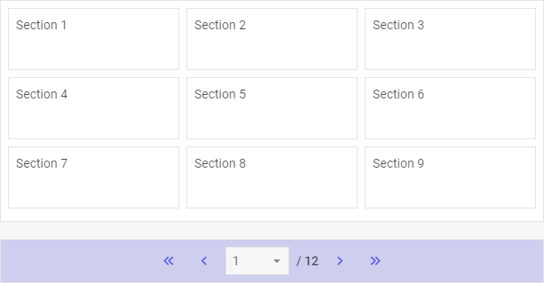

---
sidebar_label: Pager
title: Pager
---          

{{pronote
The Pager component is available in the **PRO** version only.
}}

dhtmlxPager helps to divide large amount of data into groups and display them on discrete pages. 
The component is easy-to-use and provides handy navigation that allows you to quickly jump to a desired page. dhtmlxPager is available in combination with data components like DataView, List, Grid, Tree, Treegrid. Check [online samples for dhtmlxPager](https://docs.dhtmlx.com/suite/samples/pager/).

## API Reference

- pager/api/refs/pager.md

## Related resources

- You can get dhtmlxPager as a part of the Suite library by [downloading dhtmlxSuite](https://dhtmlx.com/docs/products/dhtmlxSuite/download.shtml)          
- There are also [online samples for dhtmlxPager](https://docs.dhtmlx.com/suite/samples/pager/)  

## Guides

<table class='guide-table'>
	<tbody>
	<tr>
		<td id="data" class='topics'>
		    <ul id="data_sublist" >
            	<li>pager/init.md</li>
                <li>pager/configuration.md</li>
                <li>pager/usage.md</li>
                <li>pager/customization.md</li>
                <li>pager/handling_events.md</li>
                   
            </ul>
        </td>
		<td class='topic_description'>Covers the initialization of Pager on a page and the ways of configuring and operating the component.</td>
	</tr>
   	</tbody>
</table>

 @index:
- pager/api/refs/pager.md
- pager/init.md
- pager/configuration.md
- pager/usage.md
- pager/customization.md
- pager/handling_events.md

@metadescr:

@edition:pro
