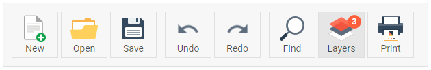

---
sidebar_label: imageButtonText Control
title: imageButtonText Control
---          

``` todo

A button with an image and a text label. Like ribbon/button.md, it can be TwoState and have a badge with a number.



## Adding imageButtonText Controls

You can add the imageButtonText control with the [add()]() method of TreeCollection:

~~~js
myRibbon.data.add({
    type: "imageButtonText",
    value: "User",
    count: 10,
    src: "../img/avatar.png"
})
~~~

{{sample
dhtmlxRibbon/samples/03_ribbon/01_init.html
}}

## Attributes

You can provide the following attributes in the configuration object of imageButtonText:

- <strong>id</strong> (string|number) - optional, the ID of the button;
- <strong>type</strong> (string) - always "imageButton";
- <strong>value</strong> (string) - optional, the label;
- <strong>src</strong> (string) - the relative path to the image;
- <strong>count</strong> (number|string) - optional, adds a badge with a number or any symbol (badge is round and doesn't expand);
- <strong>size</strong> (string) - optional, if set to "big", the button stretches vertically, not set by default;
- <strong>$hidden</strong> (boolean) - optional, hides the control;
- <strong>twoState</strong> (boolean) - optional, defines whether the button has two states (active/inactive);
- <strong>active</strong> (boolean) - optional, for two-state buttons, if true, the button is in the active state;
- <strong>css</strong> (string) - optional, adds a custom CSS class.

## Working with ImageButtonText

Just like ribbon/button.md, iconButton can be hidden or disabled. You can also manipulate the states of a twoState imageButtonText.


shall I repeat the text from Button about hide, disable, tooltip and twoState, or a simple link (as it is now) will do?

``` todo