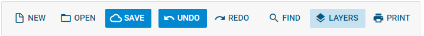

---
sidebar_label: regularButton Control
title: regularButton Control
---          

``` todo

This is a material design button that has two varieties: default and 'flat'.



## Adding regularButton

You can add regularButton with the [add()]() method of TreeCollection:

~~~js
ribbon.data.add({
    type: "regularButton",
    value: "Add",
    icon: "dxi-plus"
});
~~~

{{sample
dhtmlxRibbon/samples/03_ribbon/01_init.html
}}

## Attributes

You can provide the following attributes in the configuration object of a button:

- <strong>id</strong> (string|number) - optional, the ID of the button;
- <strong>type</strong> (string) - always "regularButton";
- <strong>icon</strong> (string) - optional, the icon;
- <strong>value</strong> (string) - optional, the label;
- <strong>size</strong> (string) - optional, "flat" - blue on transparent, default - transparent on blue;
- <strong>$hidden</strong> (boolean) - optional, hides the control;
- <strong>twoState</strong> (boolean) - optional, defines whether the button has two states (active/inactive);
- <strong>active</strong> (boolean) - optional, for two-state buttons, if true, the button is in the active state;
- <strong>css</strong> (string) - optional, adds a custom CSS class.

## Choosing the Style

By default, regularButton is blue with the light-colored text and icon. You can choose the other style and invert the colors by setting the <strong>size</strong> property to "flat":

~~~js
{
    type: "regularButton",
    value: "Add",
    size: "flat",
    icon: "dxi-plus"
}
~~~

## Working with RegularButton

Just like ribbon/button.md, iconButton can be hidden, disabled and can have a tooltip. You can also manipulate the states of a twoState iconButton.


shall I repeat the text from Button about hide, disable, tooltip and twoState, or a simple link (as it is now) will do?


``` todo