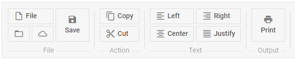

---
sidebar_label: Separator
title: Separator
---          

This is a control that adds a line separating items/groups of items from each other.

## Adding Separator 

A separator can be added between menu options:

~~~js
ribbon.data.add({
    type:"separator"
});
~~~

{{editor	 https://snippet.dhtmlx.com/wqhahyw8	Ribbon. Separator}}

## Attributes

Separator can have two attributes:

<table class="webixdoc_links">
	<tbody>
        <tr>
			<td class="webixdoc_links0"><b>type</b></td>
			<td>(<i>string</i>) the item type, set it to "separator". If not specified - the <a href="https://docs.dhtmlx.com/suite/ribbon__navitem.html">"navItem"</a> type is applied by default.</td>
		</tr>
        <tr>
			<td class="webixdoc_links0"><b>id</b></td>
			<td>(<i>string</i>) the id of a control, auto-generated if not set</td>
		</tr>
    </tbody>
</table>

## Showing/hiding Separator

You can hide and show Separator with the methods of Ribbon:

~~~js
ribbon.showItem(id);
ribbon.hideItem(id);
~~~

