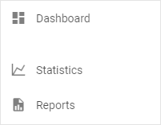

---
sidebar_label: Spacer
title: Spacer
---          

This item takes space on the sidebar and is used for aligning controls.

## Adding Spacer

A new Spacer can be created with the help of the **add()** method of Tree Collection:

~~~js
sidebar.data.add({
	type:"spacer"
});
~~~

{{editor	https://snippet.dhtmlx.com/wk50830i	Sidebar. Spacer}}

### Attributes

Spacer can have two attributes:

<table class="webixdoc_links">
	<tbody>
        <tr>
			<td class="webixdoc_links0"><b>type</b></td>
			<td>(<i>string</i>) the type of a control, set it to "spacer". If not specified - the <a href="https://docs.dhtmlx.com/suite/sidebar__navitem.html">"navItem"</a> type is applied by default.</td>
		</tr>
		<tr>
			<td class="webixdoc_links0"><b>id</b></td>
			<td>(<i>string</i>) the id of a control, auto-generated if not set</td>
		</tr>
    </tbody>
</table>

## Showing/hiding spacer

You can hide and show Spacer with the methods of sidebar:

~~~js
sidebar.show(id);
sidebar.hide(id);
~~~

 

Check the full list of available operations in the [Sidebar API](sidebar/api/refs/sidebar.md) and [Tree Collection API](tree_collection/api/refs/treecollection.md).

