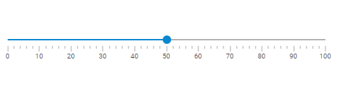

---
sidebar_label: Slider
title: Slider
description: dhtmlxSlider is a flexible and quickly adjustable JavaScript component that allows easily embedding horizontal or vertical slider bars into a web page.
---          

``` todo

dhtmlxSlider allows adding handy slider bars into web pages and applications. The component is rather flexible and easily adjustable. It is available in several modes and provides simple and convenient API. <br/>
Check [online samples for dhtmlxSlider](https://docs.dhtmlx.com/suite/samples/slider/).



## API reference

- slider/api/refs/slider.md

## Related resources

- You can get dhtmlxSlider as a part of the Suite library by [downloading dhtmlxSuite](https://dhtmlx.com/docs/products/dhtmlxSuite/download.shtml)          
- There are also [online samples for dhtmlxSlider](https://docs.dhtmlx.com/suite/samples/slider/)  

## Guides

<table class='guide-table'>
	<tbody>
	<tr>
		<td id="data" class='topics'>
		    <ul id="data_sublist" >
                    <li>slider/initializing_slider.md</li>                  
                    <li>slider/configuring_slider.md</li>
                    <li>slider/range_slider.md</li>
                    <li>slider/usage.md</li>
                    <li>slider/customization.md</li>
                    <li>slider/handling_events.md</li>                     
            </ul>
        </td>
		<td class='topic_description'>Discusses the initialization of Slider and the main techniques of manipulating this component.</td>
	</tr>   
    </tbody>
</table>

## Other
<table class='other-table'>
	<tbody>
    <tr>
        <td id="other" class='topics'>            
            <ul id="other_sublist">
                <li>slider/migration.md</li>

            </ul>
        </td>
    </tr>           
</tbody>

</table>

@index:
- slider/api/refs/slider.md
- slider/initializing_slider.md
- slider/configuring_slider.md
- slider/range_slider.md
- slider/usage.md
- slider/customization.md
- slider/handling_events.md
- slider/migration.md

``` todo