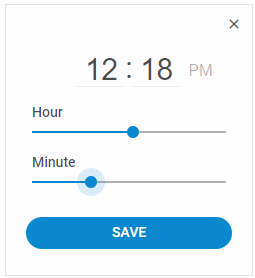

---
sidebar_label: TimePicker
title: TimePicker
description: dhtmlxTimePicker is a JavaScript component for quick and handy time selection either in 12-hour or 24-hour clock format.
---          

``` todo

dhtmlxTimePicker is a useful component for selecting time in both 12-hour and 24-hour clock format. Based on Layout and Slider components, it will work smoothly as a part of any DHTMLX-based application.<br/>
Check [online samples for dhtmlxTimePicker](https://docs.dhtmlx.com/suite/samples/timepicker/). 



## API reference

- timepicker/api/refs/timepicker.md

## Related resources

- You can get dhtmlxTimePicker as a part of the Suite library by [downloading dhtmlxSuite](https://dhtmlx.com/docs/products/dhtmlxSuite/download.shtml)          
- There are also [online samples for dhtmlxTimePicker](https://docs.dhtmlx.com/suite/samples/timepicker/)  

## Guides

<table class='guide-table'>
	<tbody>
	<tr>
		<td id="data" class='topics'>
		    <ul id="data_sublist" >
                    <li>timepicker/initialization.md</li>                  
                    <li>timepicker/configuration.md</li>
                    <li>timepicker/usage.md</li>    
                    <li>timepicker/customization.md</li>
                    <li>timepicker/handling_events.md</li>                      
            </ul>
        </td>
		<td class='topic_description'>Discusses the initialization of TimePicker and the main techniques of manipulating this component.</td>
	</tr>   
    </tbody>
</table>

## Other
<table class='other-table'>
	<tbody>
    <tr>
        <td id="other" class='topics'>            
            <ul id="other_sublist">
                <li>timepicker/migration.md</li>

            </ul>
        </td>
    </tr>           
</tbody>
</table>

@index:
- timepicker/api/refs/timepicker.md
- timepicker/initialization.md
- timepicker/configuration.md
- timepicker/usage.md
- timepicker/customization.md
- timepicker/handling_events.md
- timepicker/migration.md

``` todo