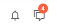

---
sidebar_label: IconButton
title: IconButton
---          

This is a button with an icon. It does not have a caption unlike toolbar/button.md, but can also have a badge with a number and can be _twoState_.

## Adding IconButtons

IconButton can be easily added to a toolbar with the help of the <strong>add()</strong> method of DataCollection:

~~~js
myToolbar.data.add({
    type: "iconButton",
    icon: "dxi-bell-outline"
});
~~~

{{sample    dhtmlxToolbar/samples/02_toolbar/01_init.html}}

You can provide the following <strong>attributes</strong> in the configuration object of iconButton:

- <strong>id</strong> - (string | number, optional) the ID of the button;
- <strong>type</strong> - (string) always "iconButton";
- <strong>icon</strong> - (string) the name of the icon (all possible icon types are in toolbar/dhx_icons.md);
- <strong>count</strong> - (number | string, optional) adds a badge with a number or any symbol;
- <strong>tooltip</strong> - (string, optional) adds a tooltip to a button;
- <strong>twoState</strong> - (boolean) defines whether the button has two states (active/inactive);
- <strong>active</strong> - (boolean) for twoState buttons, if true, the button is in the active state;
- <strong>css</strong> (string) - optional, adds a custom CSS class.

## Working with IconButton

Just like toolbar/button.md, iconButton can be hidden, disabled and can have a tooltip. You can also manipulate the states of a twoState iconButton.

shall I repeate the text from Button about hide, disable, tooltip and twoState, or a simple link (as it is now) will do?
