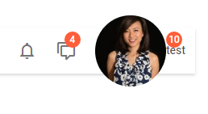

---
sidebar_label: imageButtonText Control
title: imageButtonText Control
---          

``` todo

A button with an image and a text label. Like toolbar/button.md, it can be TwoState and have a badge with a number.



## Adding imageButtonText Controls

You can add the imageButtonText control with the [add()]() method of TreeCollection:

~~~js
myToolbar.data.add({
    type: "imageButtonText",
    value: "User",
    count: 10,
    src: "../img/avatar.png"
})
~~~

You can provide the following <strong>attributes</strong> in the configuration object of imageButtonText:

- <strong>id</strong> - (string | number, optional) the ID of the button;
- <strong>type</strong> - (string) always "imageButton";
- <strong>value</strong> - (string, optional) a text label;
- <strong>src</strong> - (string) the path to the image;
- <strong>count</strong> - (number | string) adds a badge with a number or any symbol (badge is round and doesn't expand);
- <strong>size</strong> - (string) "big", "small" by default;
- <strong>tooltip</strong> - (string, optional) adds a tooltip to a button;
- <strong>twoState</strong> - (boolean) defines whether the button has two states (active/inactive);
- <strong>active</strong> - (boolean) for two-state buttons, if true, the button is in the active state;
- <strong>css</strong> (string) - optional, adds a custom CSS class.

## Working with ImageButtonText

Just like toolbar/button.md, iconButton can be hidden, disabled and can have a tooltip. You can also manipulate the states of a twoState imageButtonText.


shall I repeate the text from Button about hide, disable, tooltip and twoState, or a simple link (as it is now) will do?
the button itself doesn't look good yet(( (check out the screenshot)

``` todo