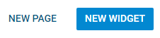

regularButton 
---
sidebar_label: 
title: 
---          

This is a material design button that has two varieties: default and 'flat'.

## Adding regularButton

You can add regularButton with the **add()** method of TreeCollection:

~~~js
toolbar.data.add({
    type: "regularButton",
    value: "Add",
    icon: "dxi-plus"
});
~~~

## Attributes

You can provide the following attributes in the configuration object of a button:

- **id** - (string | number, optional) the ID of the button;
- **type** - (string) always "regularButton";
- **icon** - (string) the icon;
- **value** - (string, optional) the label;
- **size** - (string, optional) "flat" - blue text on transparent background, by default regularButton is light text on blue background;
- **tooltip** - (string, optional) adds a tooltip to a button;
- **twoState** - (boolean) defines whether the button has two states (active/inactive);
- **active** - (boolean) for two-state buttons, if true, the button is in the active state;
- **css** (string) - optional, adds a custom CSS class.

## Choosing the Style

By default, regularButton is blue with the light-colored text and icon. You can choose the other style and invert the colors by setting the **size** property to "flat":

~~~js
{
    type: "regularButton",
    value: "Add",
    size: "flat",
    icon: "dxi-plus"
}
~~~

## Working with RegularButton

Just like toolbar/button.md, iconButton can be hidden, disabled and can have a tooltip. You can also manipulate the states of a twoState iconButton.

@todo:
looks like a DHXButton, remove or update
