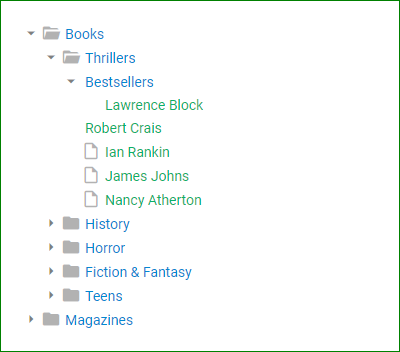
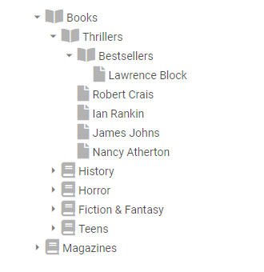

---
sidebar_label: Customization
title: Customization
---          

Styling 
----------------

There is a possibility to make changes in the look and feel of a tree. 

{{editor	https://snippet.dhtmlx.com/ocv4p7zg	Tree. Custom Styles}}

For this you need to take the following steps:

- add a new CSS class(es) with desired settings in the &lt;style&gt; section of your HTML page or in your file with styles (don't forget to include your file on the page in this case):

~~~js

~~~

- specify the name of the created CSS class (or names of classes separated by spaces) as the value of the [css](tree/api/tree_css_config.md) property in the Tree configuration:

~~~js
var tree = new dhx.Tree("tree_container", { 
    css:"my_first_class my_second_class"
});
~~~

For example:

~~~js

var tree = new dhx.Tree("tree_container", {
	css: "custom-class"
});
~~~

Changing icons 
----------------

{{editor	https://snippet.dhtmlx.com/lpsgn3j7	Tree. Custom Icons}}

You can change the default icons used for tree items. dhtmlxTree uses the [icons of the DHTMLX library](helpers/icon.md) by default. However, you can use any other icon font pack, if necessary. 
For this, you need to include the desired icon font on a page and apply icons to necessary items.

For example, you can use the [Font Awesome](https://fontawesome.com/) icon pack by including [link to its CDN](https://fontawesome.com/how-to-use/on-the-web/setup/getting-started?using=web-fonts-with-css) 
after the source files of dhtmlxTree as follows:

~~~html

<link rel="stylesheet" href="../../codebase/tree.css">

<link rel="stylesheet" href="https://use.fontawesome.com/releases/v5.3.1/css/all.css" 
  integrity="sha384-mzrmE5qonljUremFsqc01SB46JvROS7bZs3IO2EmfFsd15uHvIt+Y8vEf7N7fWAU"  
  crossorigin="anonymous">
~~~

Then you can use the name of the icon as the value of the **icon** property in the object with the configuration of an item. To use a new icon for a tree item, use the **tree.data.update()** method. Pass as parameters the
id of an item and its config object:

~~~js
tree.data.update("history", {
	icon:{
		file:"fa fa-[iconname]",
		openFolder:"fa fa-[iconname]",
		folder:"fa fa-[iconname]"
	}
});
~~~

{{note You can use the [Material Design](https://materialdesignicons.com/) icon pack by including [link to its CDN](https://cdnjs.cloudflare.com/ajax/libs/MaterialDesign-Webfont/2.5.94/css/materialdesignicons.css) in the same way.}}

