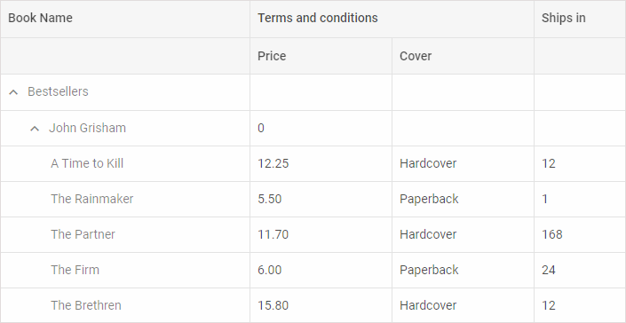

---
sidebar_label: TreeGrid
title: TreeGrid
description: dhtmlxTreeGrid is a special extension of dhtmlxGrid component for showing and editing tabular data in a hierarchical tree-like structure.

---          

{{pronote
The TreeGrid component is available in the **PRO** version only.
}}


dhtmlxTreeGrid is a special extension for [dhtmlxGrid](grid/index.md). This component allows showing the nested tabular data. Being a successor of Grid, TreeGrid inherits its API and common techniques of initialization and
usage. <br/> Check [online samples for dhtmlxTreeGrid](https://docs.dhtmlx.com/suite/samples/treegrid/).



<br/>

## API Reference

- treegrid/api/refs/treegrid.md


## Related resources

- To get just dhtmlxTreeGrid, download it from [our website](https://dhtmlx.com/docs/products/dhtmlxTreeGrid/download.shtml)
- To get the whole JavaScript library of UI components [download dhtmlxSuite](https://dhtmlx.com/docs/products/dhtmlxSuite/download.shtml)          
- There are also [online samples for dhtmlxTreeGrid](https://docs.dhtmlx.com/suite/samples/treegrid/)  

``` todo
## Guides

<table class='guide-table'>
	<tbody>
	<tr>
		<td id="data" class='topics'>
		    <ul id="data_sublist" >
            	<li>treegrid/initialization.md</li>
                <li>treegrid/configuration.md</li>
                <li>treegrid/data_loading.md</li>
                <li>treegrid/usage.md</li>
                <li>treegrid/usage_selection.md</li>
                <li>treegrid/customization.md</li>
                <li>treegrid/events.md</li>
                   
            </ul>
        </td>
		<td class='topic_description'>Says how to build a standard treegrid on a page and bring it to life: configure with specific settings, customize the default templates, attach events, etc.</td>
	</tr>
   	</tbody>
</table>

## Other

<table class='other-table'>
	<tbody>
    <tr>
        <td id="other" class='topics'>            
            <ul id="other_sublist">
                <li>treegrid/migration.md</li>

            </ul>
        </td>
    </tr>           
</tbody>

</table>

@index:
- treegrid/api/refs/treegrid.md
- treegrid/initialization.md
- treegrid/configuration.md
- treegrid/data_loading.md
- treegrid/usage.md
- treegrid/usage_selection.md
- treegrid/customization.md
- treegrid/events.md
- treegrid/migration.md
``` todo

@edition:pro
