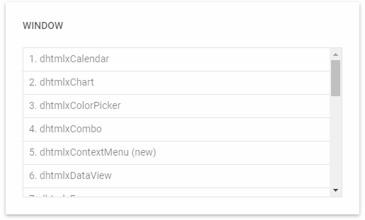

---
sidebar_label: Window
title: Window
---          

``` todo

dhtmlxWindow allows working with several windows and their content at the same time. The component provides means for performing standard operations with windows, 
such as moving/resizing a window, sending a window to the foreground/background, making a window modal, changing position and size of a window, setting content inside a window, etc.
Check [online samples for dhtmlxWindow](https://docs.dhtmlx.com/suite/samples/window/).




<div class="h2">API reference</div>

- window/api/refs/window.md


<div class="h2">Related resources</div>

- You can get dhtmlxWindow as a part of the Suite library by [downloading dhtmlxSuite](https://dhtmlx.com/docs/products/dhtmlxSuite/download.shtml)          
- There are also [online samples for dhtmlxWindow](https://docs.dhtmlx.com/suite/samples/window/)

<div class="h2">Guides</div>

<table  cellspacing="0" cellpadding="5" border="0">
	<tbody>
	<tr>
		<td id="data" class='topics'>		    
		    <ul id="data_sublist" >
			 <li>window/how_to_start.md</li>	
             <li>window/configuration.md</li>
             <li>window/usage.md</li>
             <li>window/customization.md</li>
             <li>window/handling_events.md</li>
            </ul>
        </td>
		<td class='topic_description'>Covers the features of configuring and operating Window, as well as customizing its look ant feel.</td>
	</tr>
    </tbody>
</table>

<div class="h2">Other</div>

<table class='other-table'>
	<tbody>
    <tr>
        <td id="other" class='topics'>            
            <ul id="other_sublist">
                <li>window/migration.md</li>

            </ul>
        </td>
    </tr>           
</tbody>

</table>

@index:
- window/api/refs/window.md
- window/how_to_start.md
- window/configuration.md
- window/usage.md
- window/customization.md
- window/handling_events.md
- window/migration.md


@metadescr:
dhtmlxWindow is a JavaScript component for adding easy-to-use windows to applications. The component possesses rich configuration possibilities and provides a lot of means for creating attractive windows that have the desktop functionality.

``` todo
